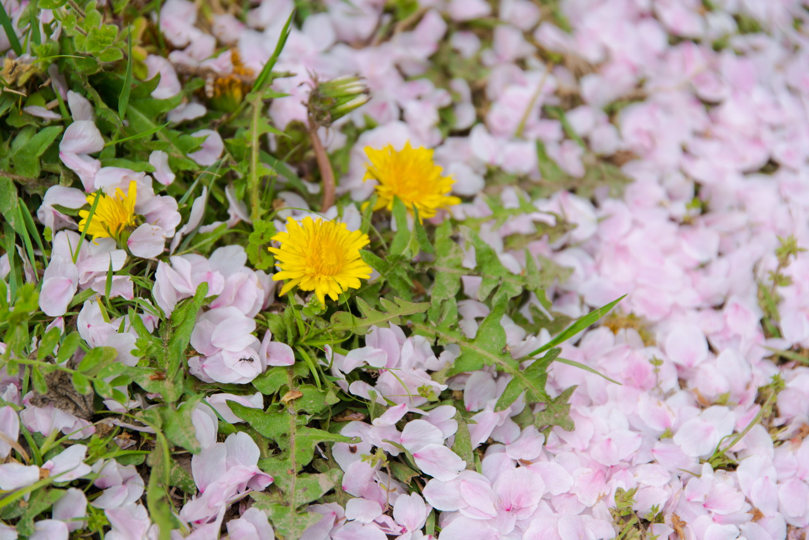
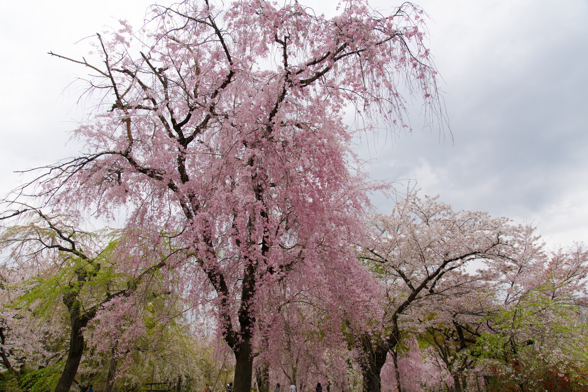
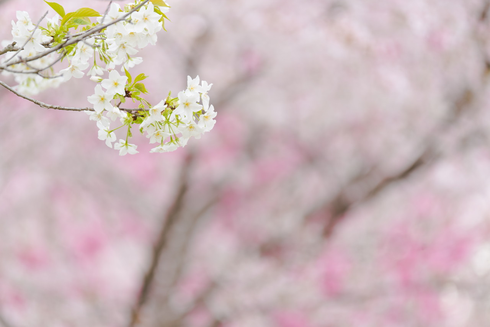
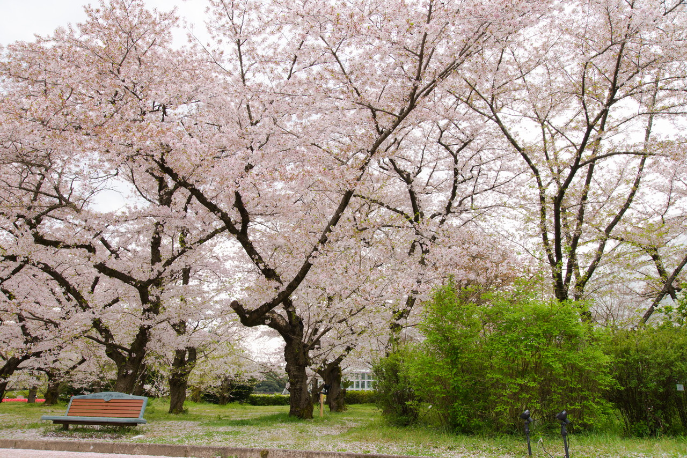
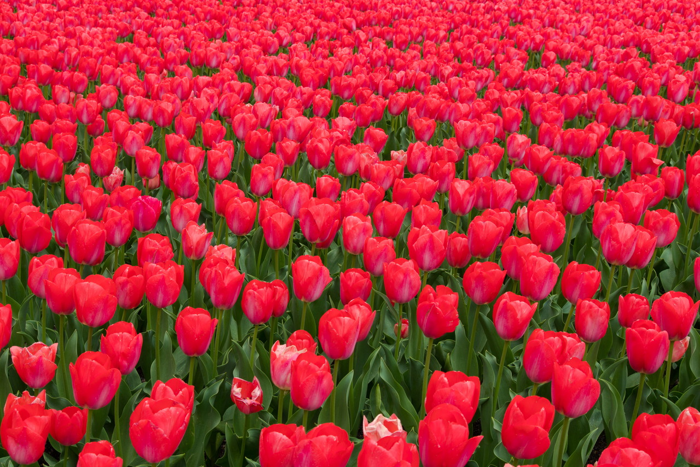
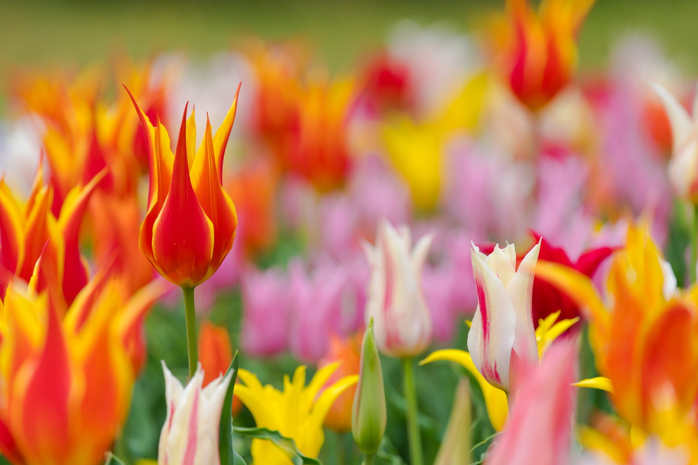
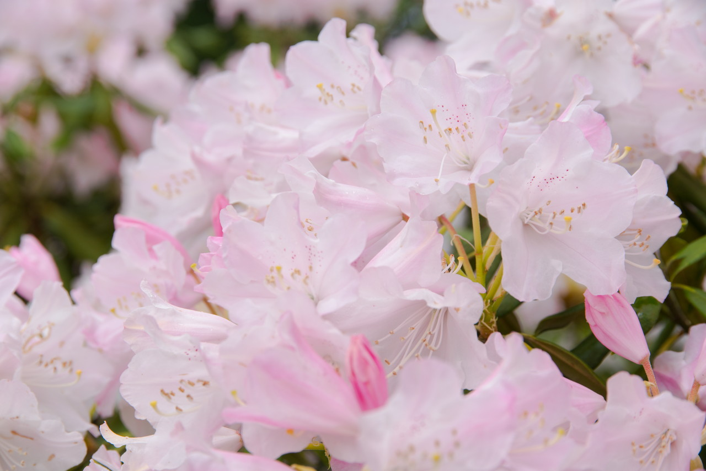

すっかり春です。
天気に恵まれず、小雨まじりの空模様でしたが、
しっかり春を感じてきました。

### タンポポと桜

### 枝垂れ桜

### ちょっと印象的に

### ソメイヨシノも満開

植物園では、桜の他にもチューリップも見頃でした。

### チューリップも満開

### チューリップも印象的に

そろそろシャクナゲも見頃をむかえそうです。

### もうすぐ見頃のシャクナゲ

 
 
 

他の画像、高解像度は[こちら](https://goo.gl/photos/iSvoVWRT6wCeFgXW7)

<iframe src="https://www.google.com/maps/embed?pb=!1m18!1m12!1m3!1d3266.3003236914933!2d135.7603871162201!3d35.049229880346395!2m3!1f0!2f0!3f0!3m2!1i1024!2i768!4f13.1!3m3!1m2!1s0x6001081b1979efd5%3A0x9bba6e81c2248ac5!2z5Lqs6YO95bqc56uL5qSN54mp5ZyS!5e0!3m2!1sja!2sjp!4v1492691969218" width="400" height="300" frameborder="0" style="border:0" allowfullscreen></iframe>

---

___Sony α99 II(ILCA-99M2)___  
_SIGMA 24-105mm F4 DG HSM Art_  
_SONY 70-300mm F4.5-5.6 G SSM_  

