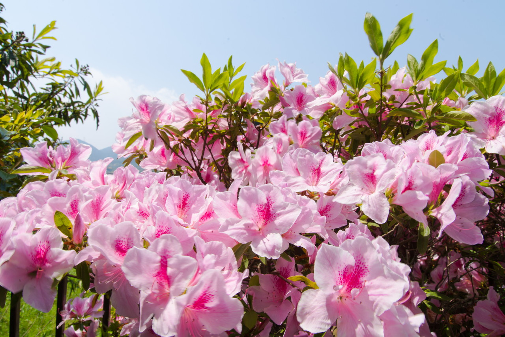
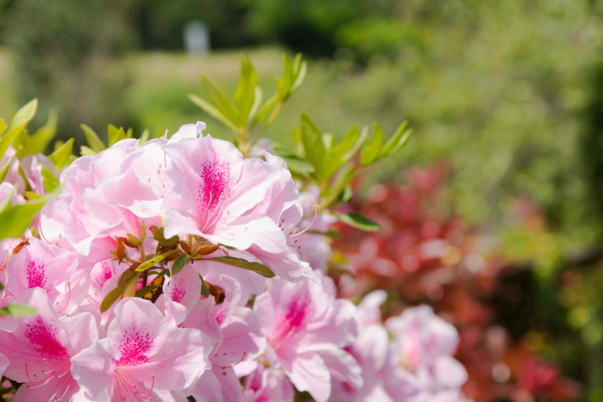
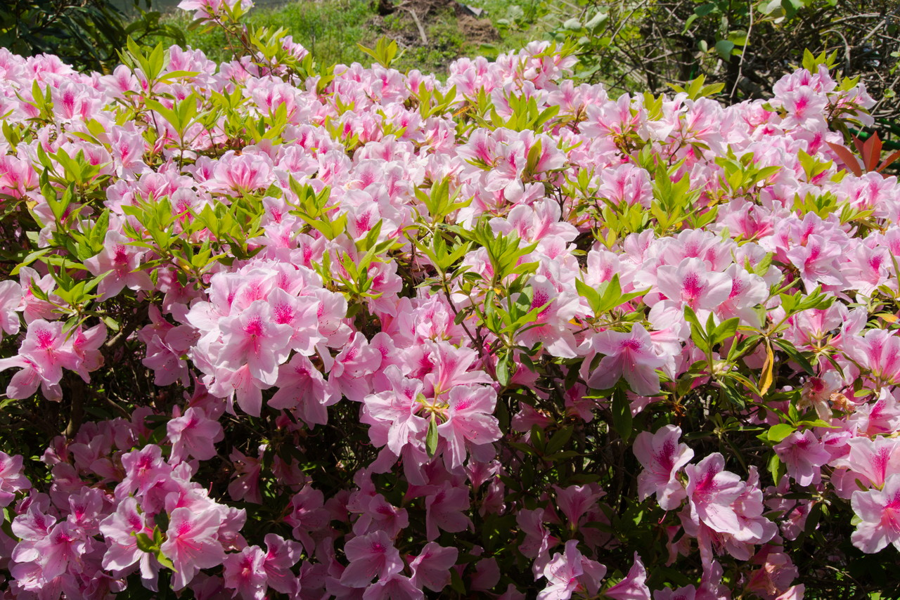
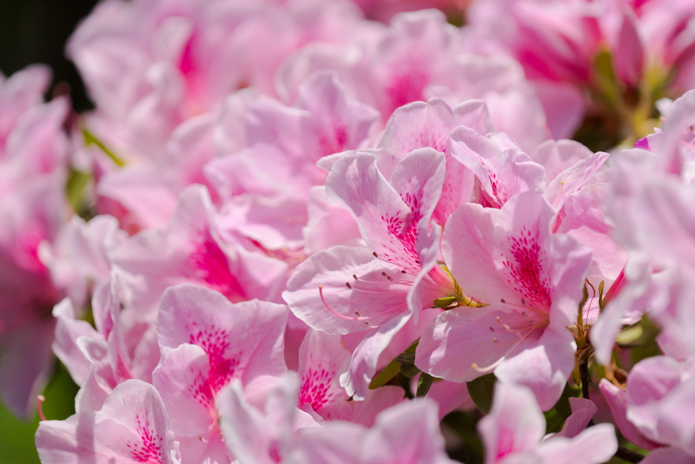
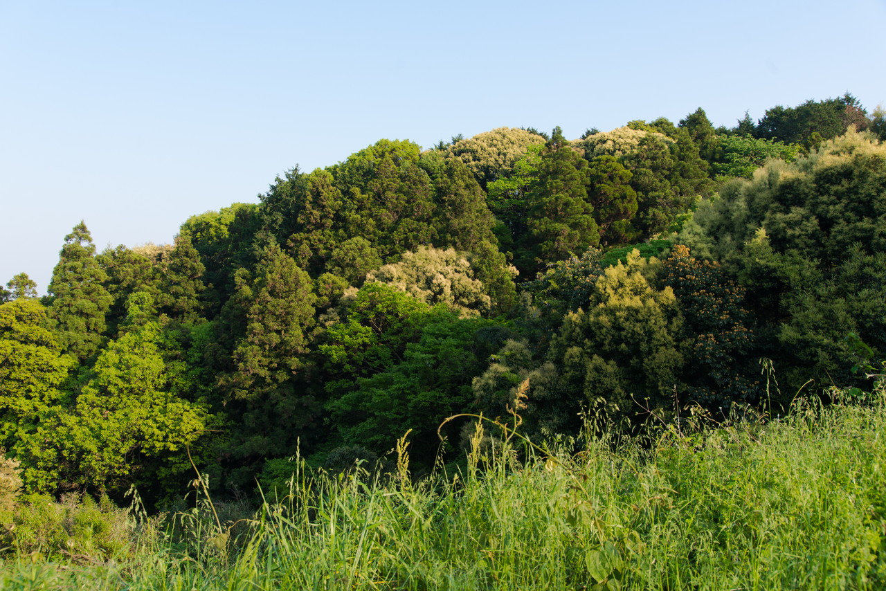
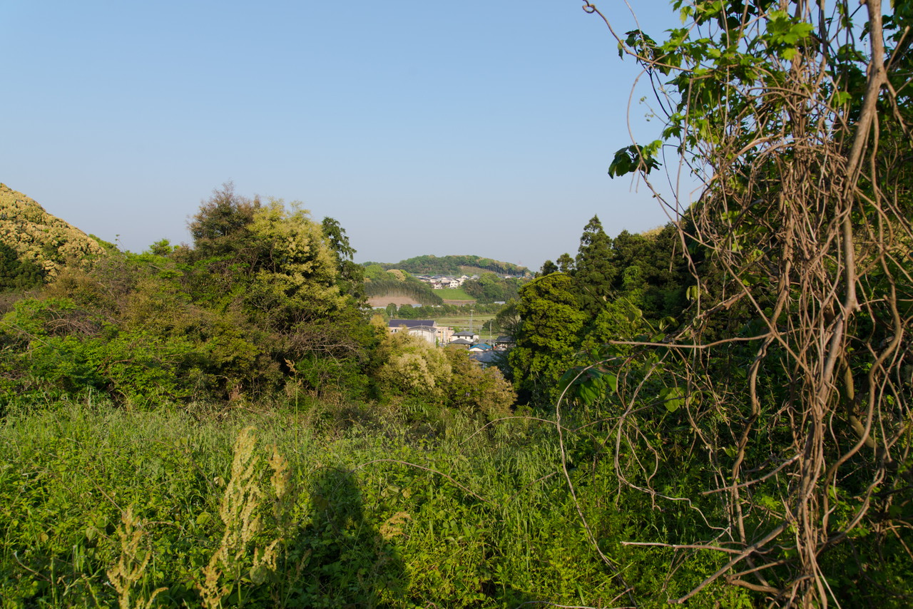

今年のゴールデンウィークも福岡の実家でのんびりすることにしました。  
今年は天気に恵まれているようで、スカッと晴れて気持ちいいです。

### 実家の庭のツツジ

この時期に見頃のツツジが満開でした。

### 近くの山

実家のすぐ近く(というか目の前)の山です。  
家の中でゴロゴロしっぱなしだったので、夕方ちょっと散歩しました。  
近くに高速のインターチェンジができてから、  
だいぶ開発が進み、山々の形が変わってしまいましたが、自然がまだあるいいところです。

---

### 福岡県筑紫野市

<iframe src="https://www.google.com/maps/embed?pb=!1m18!1m12!1m3!1d106475.8207488431!2d130.46775151526208!3d33.49176511416488!2m3!1f0!2f0!3f0!3m2!1i1024!2i768!4f13.1!3m3!1m2!1s0x35419be6aca2b711%3A0x5c6eacee447ad387!2z56aP5bKh55yM562R57Sr6YeO5biC!5e0!3m2!1sja!2sjp!4v1493691321249" width="400" height="300" frameborder="0" style="border:0" allowfullscreen></iframe>

---

___Sony α99 II(ILCA-99M2)___  
_SIGMA 24-105mm F4 DG HSM Art_  
_SONY 70-300mm F4.5-5.6 G SSM_  

