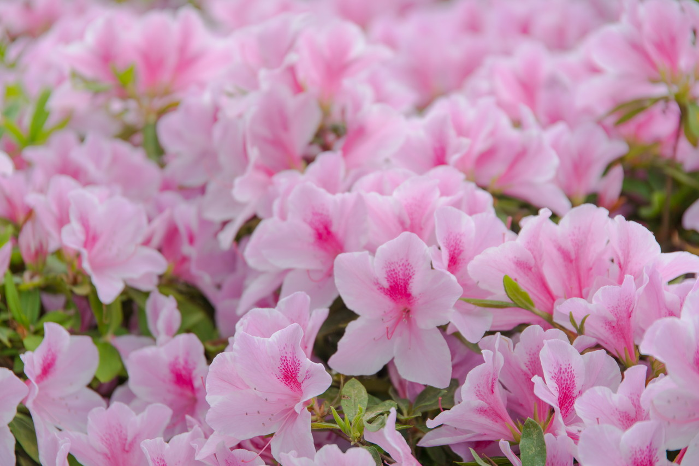
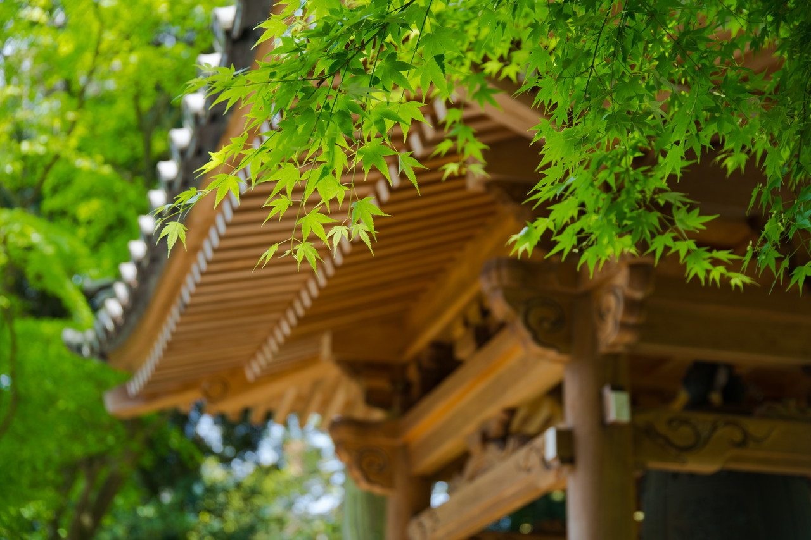
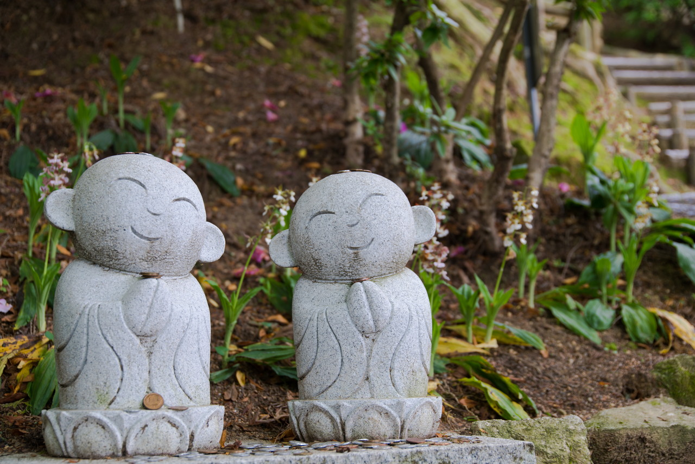

今年のゴールデンウィークもツツジと藤を見(撮り)に行きました。  
天気にも恵まれよかったです。

## 大興善寺(つつじ寺)

今年も大興善寺(つつじ寺)に行ってきました。  
カレンダー上では、平日だったため、思ったいていたより人が少なかったです。  
ツツジ、シャクナゲが満開で綺麗でした。

### ツツジ

### 一目一万本のツツジ

ここのツツジのメインスポット「一目一万本」です。

今年は一気に見頃を迎えたため、斜面一面のツツジが見られました。

### もっとツツジ

### 新緑の季節

モミジは秋の紅葉が有名ですが、新緑の時季の"緑色のモミジ"もキレイです。

### シャクナゲも見頃

時季的には若干遅めの開花でしたが、シャクナゲもキレイでした。

### お地蔵さん

ツツジの植え込みの間にはカワイイお地蔵さんがありました。

## 武蔵寺

福岡県筑紫野市で藤の名所として有名な武蔵寺に行ってきました。  
今年は若干開花が遅かったようです。  
ほぼ満開、見頃で綺麗でした。

### まずは猫

にゃーん

うにゃーん

### フジ

フジ、キレイでした。

### 新緑の季節 Part2

やっぱりこの季節の緑はキレイです。

### 石楠花谷へ

シャクナゲもキレイでした。

 
 
他の画像、高解像度は[こちら(Google Photo)](https://goo.gl/photos/RSRoHegrMR7JZp5L8)と[こちら(Google Photo)](https://goo.gl/photos/UtiCWsGvnyVcujsVA)

---

### 大興善寺(つつじ寺)

<iframe src="https://www.google.com/maps/embed?pb=!1m18!1m12!1m3!1d989.9498509332888!2d130.49567324858106!3d33.428950282174185!2m3!1f0!2f0!3f0!3m2!1i1024!2i768!4f13.1!3m3!1m2!1s0x35419875915ec207%3A0xae739a784adfdc39!2z5aSn6IiI5ZaE5a-6!5e0!3m2!1sja!2sjp!4v1493775430976" width="400" height="300" frameborder="0" style="border:0" allowfullscreen></iframe>

### 武蔵寺

<iframe src="https://www.google.com/maps/embed?pb=!1m18!1m12!1m3!1d3327.4577241139577!2d130.50566931476683!3d33.48946645462471!2m3!1f0!2f0!3f0!3m2!1i1024!2i768!4f13.1!3m3!1m2!1s0x35419983545c185d%3A0x859fa962517ea87d!2z5q2m6JS15a-6!5e0!3m2!1sja!2sjp!4v1493775481816" width="400" height="300" frameborder="0" style="border:0" allowfullscreen></iframe>

---

___Sony α99 II(ILCA-99M2)___  
_SIGMA 24-105mm F4 DG HSM Art_  
_SONY 70-300mm F4.5-5.6 G SSM_  