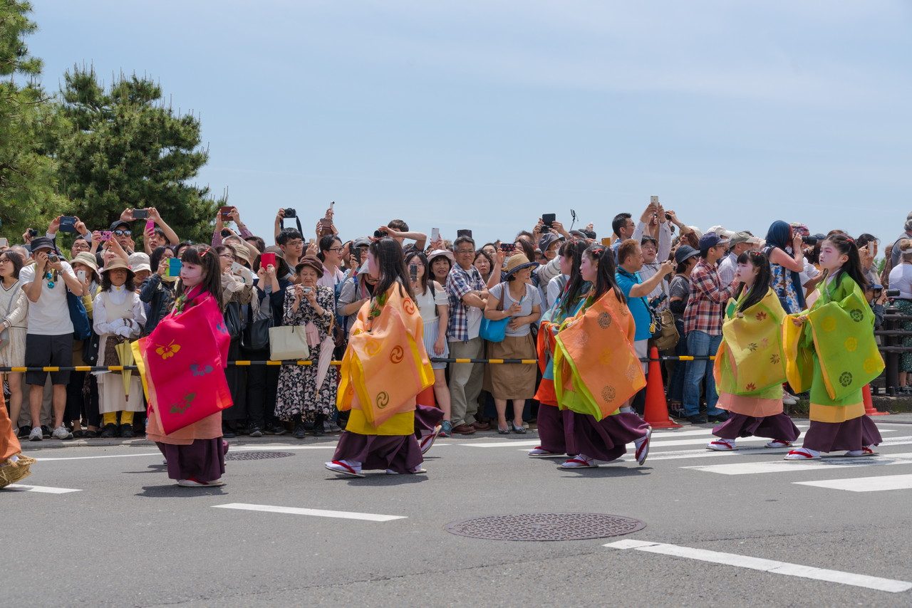

京都三大祭の葵祭に見に行ってきました。  
去年と同じ場所で見学、写真を撮ってきました。  
日差しは強かったですが、時折、涼しく、気持ちいい風が吹き、  
5月らしい日和でした。  
行列の方々は服や帽子に「葵」付けていました。今年は去年に比べて余裕を持って  
見学できました。  
来年は別の場所で見学したいです。  
  

## 路頭の儀

京都府警察　平安騎馬隊

斎王代

 
 
他の画像、高解像度は[こちら(Google Photo)](https://goo.gl/photos/TsYDiLJ4sRcVJyxD6)

---

### 出町柳、下鴨神社付近

<iframe src="https://www.google.com/maps/embed?pb=!1m14!1m12!1m3!1d1697.1398183383446!2d135.77147413814487!3d35.03073907801751!2m3!1f0!2f0!3f0!3m2!1i1024!2i768!4f13.1!5e0!3m2!1sja!2sjp!4v1494938910705" width="600" height="450" frameborder="0" style="border:0" allowfullscreen></iframe>

---

___Sony α99 II(ILCA-99M2)___  
_SIGMA 24-105mm F4 DG HSM Art_  