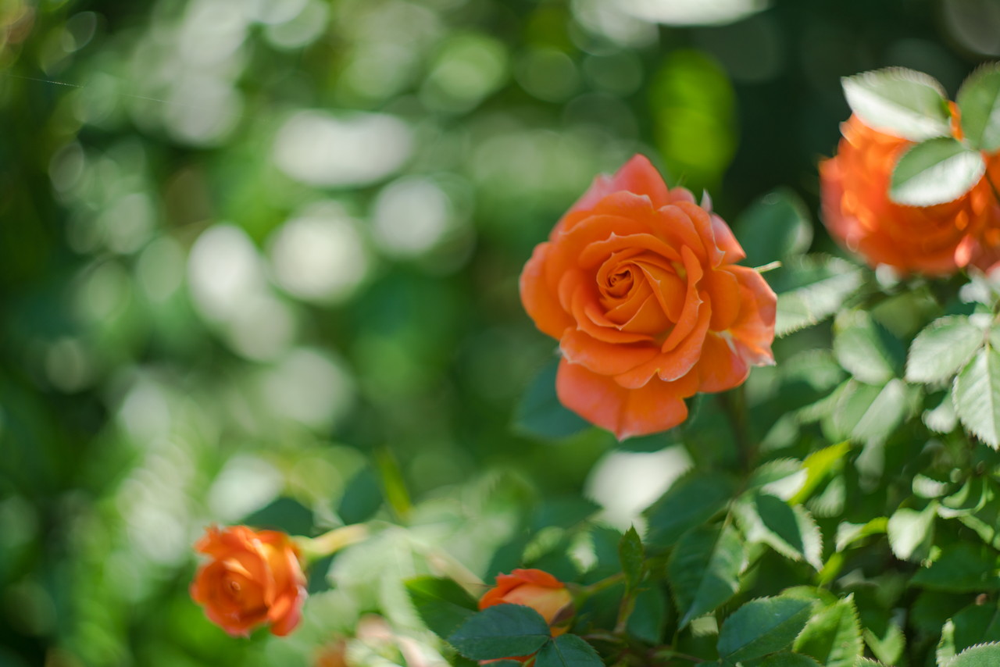
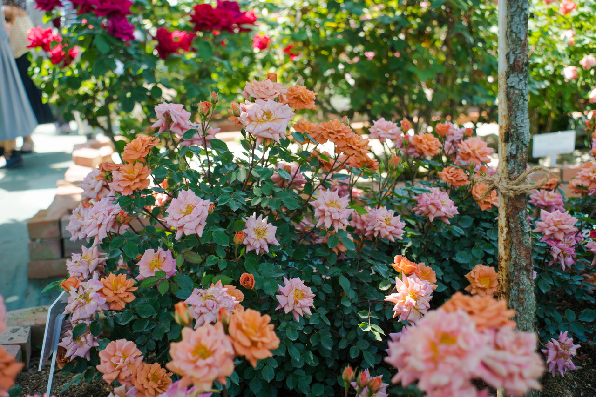
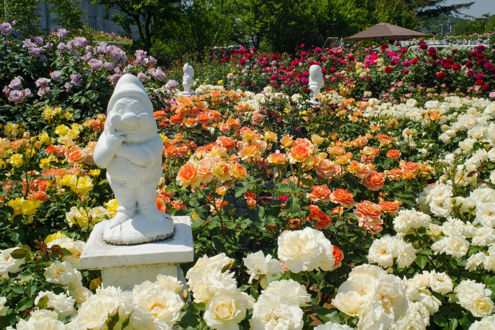
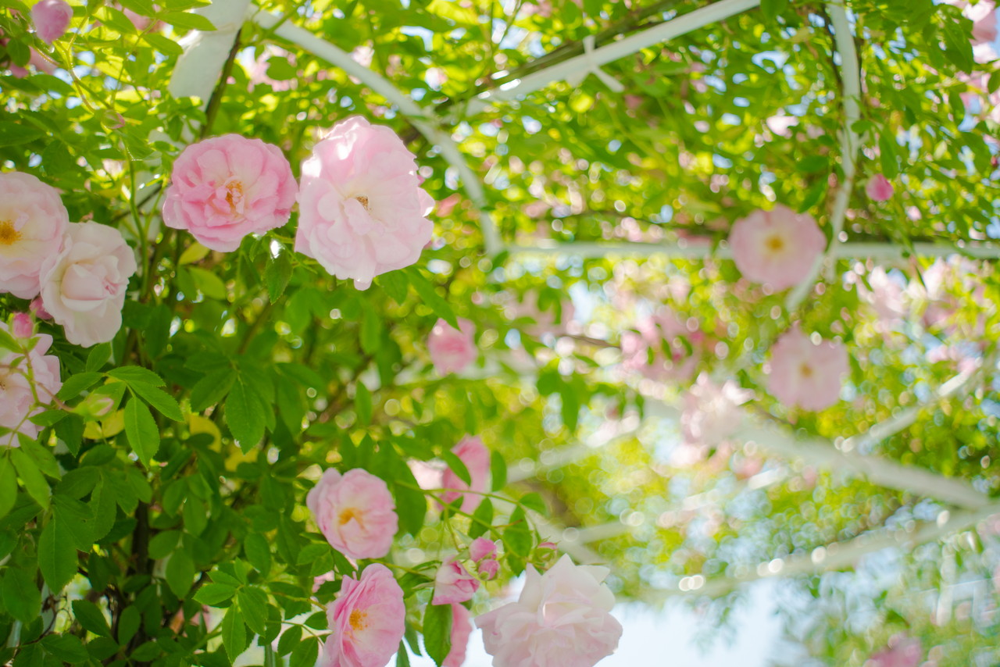
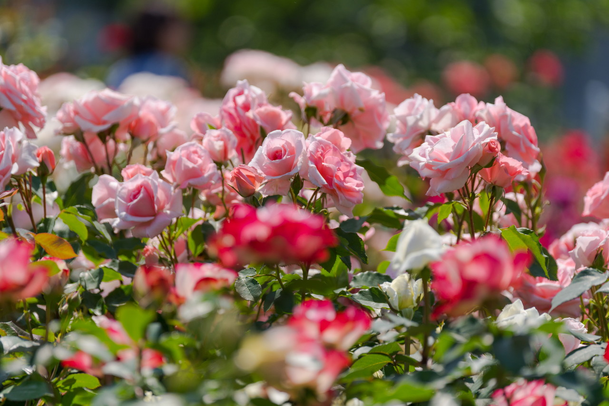
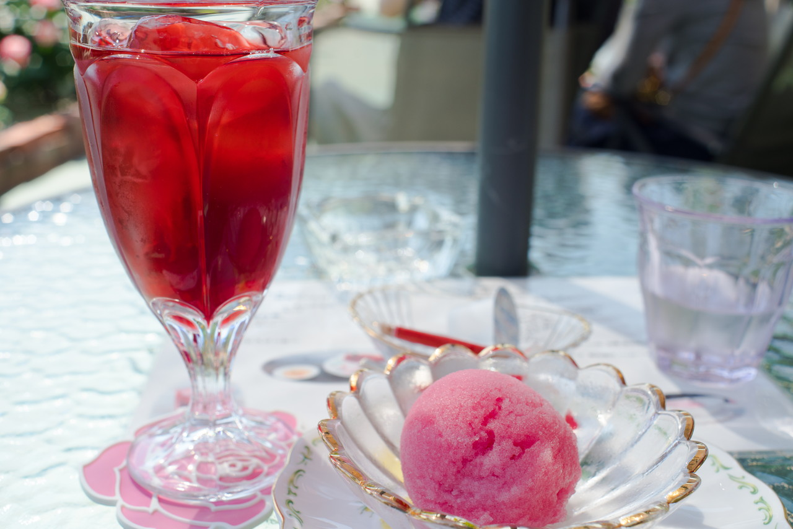

今年も姫路ばら園に行ってきました。  
暑かったせいか、ちょっと体がだるかったです。  
休み休みバラを撮ってきました。  
 
### ばら、バラ、薔薇

### バラのシャーベットとバラの紅茶

おいしかったです。

 
 
他の画像、高解像度は[こちら(Google Photo)](https://goo.gl/photos/vtftw6PThNXyaaJj7)

---

### 姫路ばら園

<iframe src="https://www.google.com/maps/embed?pb=!1m18!1m12!1m3!1d3272.536345630218!2d134.73089061643853!3d34.892987480385464!2m3!1f0!2f0!3f0!3m2!1i1024!2i768!4f13.1!3m3!1m2!1s0x355521872ea8c77d%3A0xb2f6e0b0fc7ab48!2z5aer6Lev44Gw44KJ5ZyS!5e0!3m2!1sja!2sjp!4v1495967280405" width="600" height="450" frameborder="0" style="border:0" allowfullscreen></iframe>

---

___Sony α99 II(ILCA-99M2)___  
_SIGMA 24-105mm F4 DG HSM Art_  
_Carl Zeiss Jena Flektogon 35mm F2.8_  
_HELIOS-44-2 M42 2/58_  
