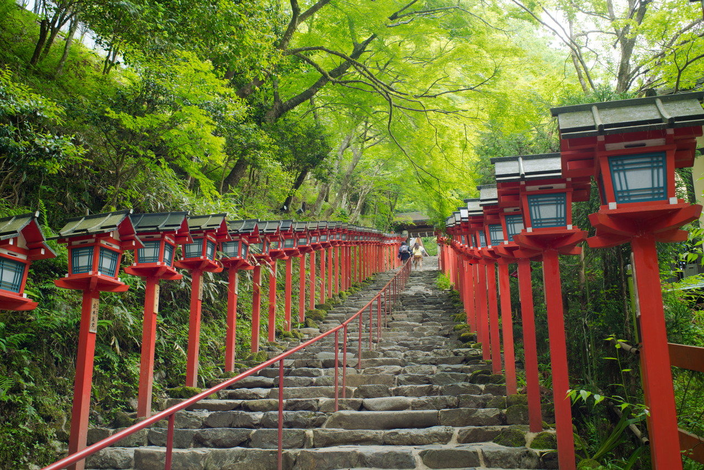
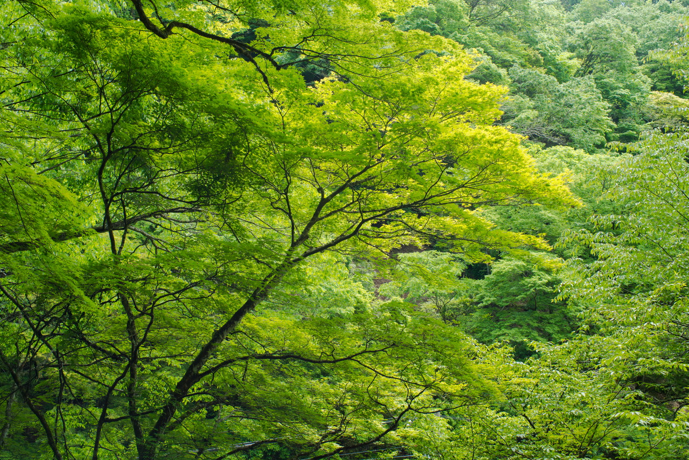
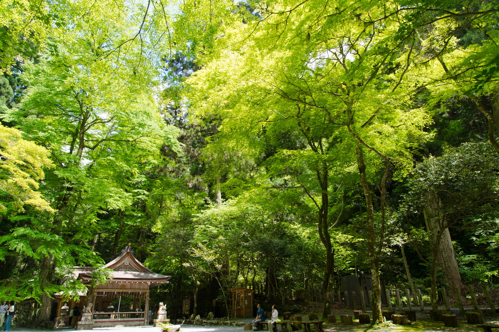
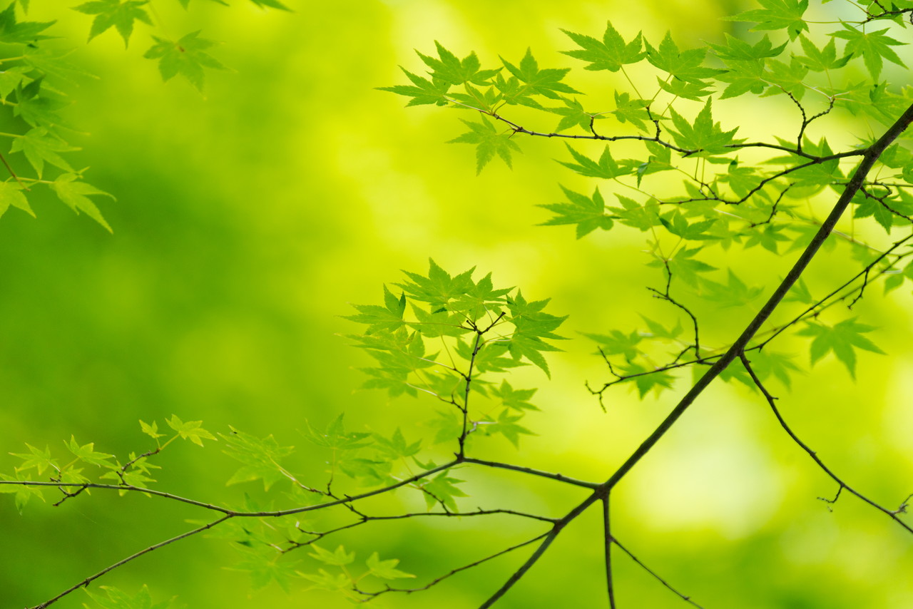
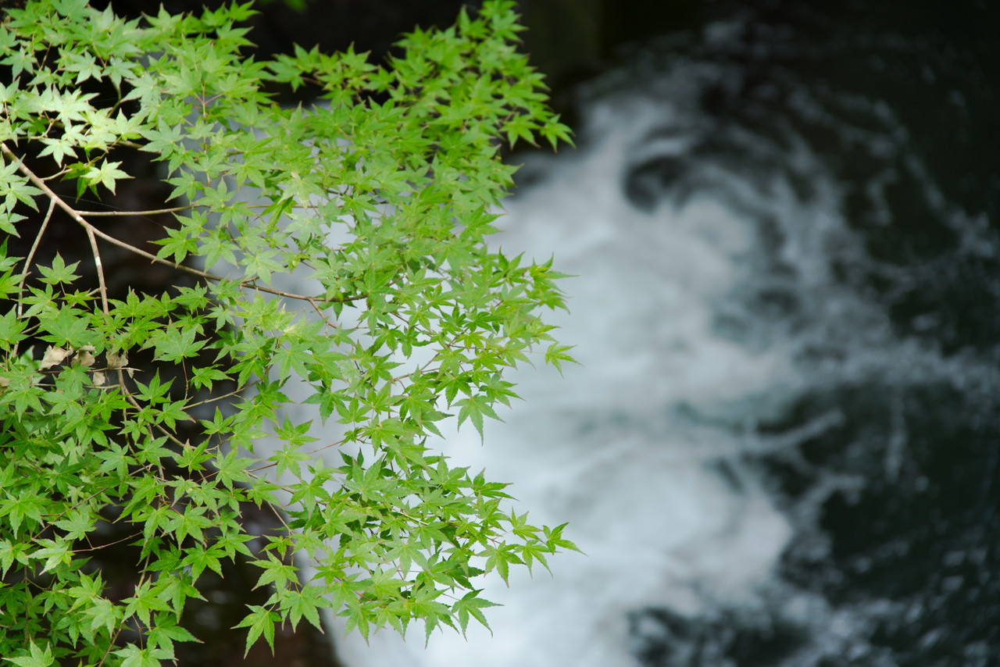

2017年05月27日 貴船神社  
新緑の季節です。というか初夏ですね。  
青紅葉がきれいな時季です。  
貴船神社は秋の紅葉が有名ですが、私は青紅葉が好きですね。  

May 27, 2017 Kibune-Jinja shrine  
It is the season of fresh green. I mean early summer.  
It is the season when the blue autumn leaves are beautiful.  
Kibune shrine is famous for autumn leaves, but I like blue leaves.  
  
 
### 新緑

参道 #新緑 #青紅葉 #神社 #shrine #japan #sonya99ii #CarlZeissJenaFlektogon #flektogon #oldlens #オールドレンズ #東独レンズ

舞台からの風景 #新緑 #青紅葉 #神社 #shrine #japan #sonya99ii #CarlZeissJenaFlektogon #flektogon #oldlens #オールドレンズ #東独レンズ

奥宮 #新緑 #青紅葉 #神社 #shrine #japan #sonya99ii #sigma

青紅葉 #新緑 #青紅葉 #神社 #shrine #japan #sonya99ii #sony

青紅葉 #新緑 #青紅葉 #神社 #shrine #japan #sonya99ii #sigma
`

 
 
他の画像、高解像度は[こちら(Google Photo)](https://goo.gl/photos/2kbJMh1NgHDdnaETA)

---

### 貴布禰総本宮 貴船神社

<iframe src="https://www.google.com/maps/embed?pb=!1m18!1m12!1m3!1d3263.401989287545!2d135.76071751618863!3d35.12164068032851!2m3!1f0!2f0!3f0!3m2!1i1024!2i768!4f13.1!3m3!1m2!1s0x6001a608f30a9109%3A0x1d021ae4b564548b!2z6LK05biD56aw57eP5pys5a6uIOiytOiIueelnuekvg!5e0!3m2!1sja!2sjp!4v1497265430006" width="600" height="450" frameborder="0" style="border:0" allowfullscreen></iframe>

---

___Sony α99 II(ILCA-99M2)___  
_SIGMA 24-105mm F4 DG HSM Art_  
_SONY 70-300mm F4.5-5.6 G SSM_  
_Carl Zeiss Jena Flektogon 35mm F2.8_  

