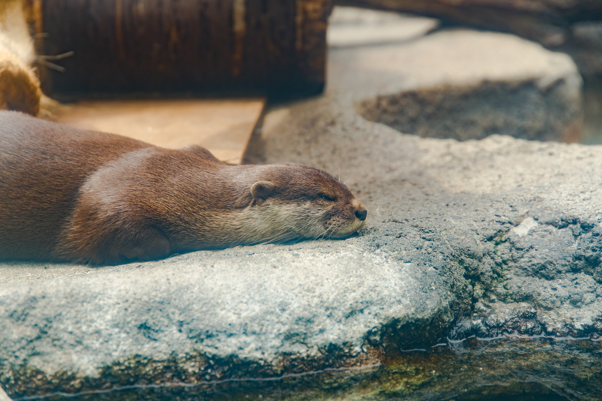

2017年07月13～16日 Tokyo trip.  
会社の研修が終わったあとの連休を利用して東京観光をしてきました。  
観光の目標は、  

* 昼と夜の東京スカイツリー
* いくつかの神社とお寺で御朱印をいただく
* 東京タワー
* オンラインゲームで知り合った友人に会う
* 多摩動物公園のサーバル

7月に入り酷暑が続くようになりましたが、充実した4日間でした。
  
## 1日目(7/13)

この日は、日中は研修で、夕方に解放されて、会社の先輩だった方ととてもおいしい焼き鳥をいただきました。  
話が盛り上がって楽しかったです。  
先輩、ごちそうさまでした。  
※焼き鳥の写真はありません。

### 夜の東京スカイツリー

楽しい夕食のあと、ライトアップされた夜のスカイツリーを撮りに行きました。

夜のスカイツリー #東京スカイツリー #skytree #tower #japan #tokyo #sonya99ii #sigma

## 2日目(7/14)

2日目は朝からスカイツリーにのぼりました。平日の朝だったため、人は少なかったです。

### スカイツリーからの眺め

いい眺めでした。

スカイツリーからの眺め その1 #東京スカイツリー #skytree #tower #japan #tokyo #sonya99ii #sigma

スカイツリーからの眺め その2 #東京スカイツリー #skytree #tower #japan #tokyo #sonya99ii #sigma

### スカイツリーの中

ほんと、人が少なかったです。天望デッキから天望回廊までのエレベーターは一人で乗りました。  
進撃の巨人のコラボイベントやってました。

天望回廊 #東京スカイツリー #skytree #tower #japan #tokyo #sonya99ii #sigma

進撃の巨人コラボ #東京スカイツリー #skytree #tower #japan #tokyo #sonya99ii #sigma

### 日中のスカイツリー

この日も暑かったです。

日中のスカイツリー #東京スカイツリー #skytree #tower #japan #tokyo #sonya99ii #sigma

### すみだ水族館

スカイツリーの足元にすみだ水族館があります。  
大きくはありませんが見応えはありました。  
この時は金魚のイベントが行われていました。

すみだ水族館その1 #すみだ水族館 #水族館 #quarium #japan #tokyo #sonya99ii #sigma

すみだ水族館その2 #すみだ水族館 #水族館 #quarium #japan #tokyo #sonya99ii #sigma

### 寛永寺

東京スカイツリーを後にして上野公園の近くにある寛永寺へ。  
徳川幕府と縁が強いお寺です。御朱印をいただきました。

寛永寺その1 #寛永寺 #寺 #temple #japan #tokyo #sonya99ii #sigma

寛永寺その2 #寛永寺 #寺 #temple #japan #tokyo #sonya99ii #sigma

### 休憩

炎天下の中上野公園を縦断していましたが、汗だくになるほどでした。  
ちょっと休憩。

スターバックスで休憩 #上野公園 #公園 #park #STARBUCKS #japan #tokyo #sonya99ii #sigma

### 西郷どん

西郷隆盛像です。

西郷どん #上野公園 #公園 #park #西郷隆盛 #japan #tokyo #sonya99ii #sigma

### 柴又帝釈天

上野公園を後にして、友人と合流。ドライブをしながら柴又へ。  
寅さんで有名な帝釈天とその門前町に行きました。  
帝釈天では御朱印をいただきました。
Tiggerさん、上天丼おいしゅうございました。ありがとうございました。

帝釈天 #帝釈天 #寺 #temple #japan #tokyo #sonya99ii #sigma

寅さんその1 #寅さん #男はつらいよ #japan #tokyo #sonya99ii #sigma

寅さんその2 #寅さん #男はつらいよ #japan #tokyo #sonya99ii #sigma

その後、草加に移動。さらに友人と合流して、おいしい焼き肉をいただきました。
Taguさん、ごちそうさまでした。ありがとうございました。

## 3日目(7/15)

3日目は、朝8時半頃、草加を出発。いざ東京タワーへ。

### 東京タワー

東京は短期間住んでたり、何回もきていますが、東京タワーは今回がお初です。

東京タワーその1 #東京タワー #tokyotower #tower #japan #tokyo #sonya99ii #sigma

東京タワーその2 #東京タワー #tokyotower #tower #japan #tokyo #sonya99ii #sigma

### 増上寺

東京タワーのお膝元の増上寺へ。  
ここでも御朱印をいただきました。

増上寺 #増上寺 #寺 #temple #japan #tokyo #sonya99ii #sigma

### 靖国神社

増上寺を後にして、靖国神社へ。  
さすがに暑くてギブ・・・＿|￣|○  
靖国神社へはタクシーで移動しました・・・。
祭事「みたままつり」の期間中だったようです。
ここでも御朱印をいただきました。

靖国神社その1 #靖国神社 #神社 #shrine #japan #tokyo #sonya99ii #sigma

靖国神社その2 #靖国神社 #神社 #shrine #japan #tokyo #sonya99ii #sigma

靖国神社その3 #靖国神社 #神社 #shrine #japan #tokyo #sonya99ii #sigma

零戦もありました。

零戦 #零戦 #wwii #japan #tokyo #sonya99ii #sigma

### 明治神宮

靖国神社を後に、明治神宮へ。  
外国人観光客が結構多かったです。

明治神宮その1 #明治神宮 #神社 #shrine #japan #tokyo #sonya99ii #sigma

明治神宮その2 #明治神宮 #神社 #shrine #japan #tokyo #sonya99ii #sigma

このあと、多摩まで移動して、3日目終了。

## 4日目(7/16)

この日はサーバルキャットがいる多摩動物公園へ。  
アニメ「けものフレンズ」で一躍人気になった動物です。

### 多摩動物公園

んで、そのサーバル。

サーバル #サーバル #多摩動物公園 #zoo #japan #tokyo #sonya99ii #sigma

目標達成。  
この日は曇っていましたが、朝から蒸し暑かったです。  
なので、動物たちもぐったりでしてました。

屍のようなライオン #ライオン #lion #多摩動物公園 #zoo #japan #tokyo #sonya99ii #sigma

ぐったりしたカンガルー #カンガルー #多摩動物公園 #zoo #japan #tokyo #sonya99ii #sigma

すやすやコアラ #コアラ #多摩動物公園 #zoo #japan #tokyo #sonya99ii #sigma

ねむねむなコツメカワウソ #カワウソ #多摩動物公園 #zoo #japan #tokyo #sonya99ii #sigma

以上で東京旅行終了、夕方大阪に着きました。
また、行きたいです。

 
 
他の画像、高解像度は[こちら(Google Photo)](https://goo.gl/photos/Xc3hneSGikS382WD6)

---

### 東京スカイツリー
<iframe src="https://www.google.com/maps/embed?pb=!1m14!1m8!1m3!1d12958.627135224153!2d139.8107004!3d35.7100627!3m2!1i1024!2i768!4f13.1!3m3!1m2!1s0x0%3A0x7d1d4fb31f43f72a!2z5p2x5Lqs44K544Kr44Kk44OE44Oq44O8!5e0!3m2!1sja!2sjp!4v1501765004837" width="600" height="450" frameborder="0" style="border:0" allowfullscreen></iframe>

---
### すみだ水族館
<iframe src="https://www.google.com/maps/embed?pb=!1m14!1m8!1m3!1d1779.2292273452115!2d139.81046564446322!3d35.71035896345847!3m2!1i1024!2i768!4f13.1!3m3!1m2!1s0x0%3A0x52f9e68583464160!2z44GZ44G_44Gg5rC05peP6aSo!5e0!3m2!1sja!2sjp!4v1501765109179" width="600" height="450" frameborder="0" style="border:0" allowfullscreen></iframe>

---
### 寛永寺
<iframe src="https://www.google.com/maps/embed?pb=!1m18!1m12!1m3!1d2257.6089732741966!2d139.77435417452818!3d35.72177485494054!2m3!1f0!2f0!3f0!3m2!1i1024!2i768!4f13.1!3m3!1m2!1s0x60188e818f384bb3%3A0x37e58f8927830467!2z5a-b5rC45a-6!5e0!3m2!1sja!2sjp!4v1501765211249" width="600" height="450" frameborder="0" style="border:0" allowfullscreen></iframe>

---
### 上野公園
<iframe src="https://www.google.com/maps/embed?pb=!1m18!1m12!1m3!1d6478.888631071423!2d139.7693081299267!3d35.71528977074546!2m3!1f0!2f0!3f0!3m2!1i1024!2i768!4f13.1!3m3!1m2!1s0x0%3A0x72922ced2a70a7d0!2z6KW_6YO36ZqG55ub6YqF5YOP!5e0!3m2!1sja!2sjp!4v1501765266296" width="600" height="450" frameborder="0" style="border:0" allowfullscreen></iframe>

---
### 柴又　帝釈天
<iframe src="https://www.google.com/maps/embed?pb=!1m18!1m12!1m3!1d1572.762247128183!2d139.8765388290662!3d35.75829307180062!2m3!1f0!2f0!3f0!3m2!1i1024!2i768!4f13.1!3m3!1m2!1s0x601885a32dacd473%3A0x550a90c0da0aaf97!2z5p-05Y-I5bid6YeI5aSp77yI57WM5qCE5bGxIOmhjOe1jOWvuu-8iQ!5e0!3m2!1sja!2sjp!4v1501765328590" width="600" height="450" frameborder="0" style="border:0" allowfullscreen></iframe>

---
### 東京タワー
<iframe src="https://www.google.com/maps/embed?pb=!1m18!1m12!1m3!1d3241.747975468362!2d139.74324421620267!3d35.65858048019977!2m3!1f0!2f0!3f0!3m2!1i1024!2i768!4f13.1!3m3!1m2!1s0x60188bbd9009ec09%3A0x481a93f0d2a409dd!2z5p2x5Lqs44K_44Ov44O8!5e0!3m2!1sja!2sjp!4v1501765398547" width="600" height="450" frameborder="0" style="border:0" allowfullscreen></iframe>

---
### 増上寺
<iframe src="https://www.google.com/maps/embed?pb=!1m18!1m12!1m3!1d3241.794938322478!2d139.74601921620257!3d35.657423580199826!2m3!1f0!2f0!3f0!3m2!1i1024!2i768!4f13.1!3m3!1m2!1s0x60188bbe91676c0b%3A0x88a4a86ddb1dbd24!2z5aKX5LiK5a-6!5e0!3m2!1sja!2sjp!4v1501765454215" width="600" height="450" frameborder="0" style="border:0" allowfullscreen></iframe>

---
### 靖国神社
<iframe src="https://www.google.com/maps/embed?pb=!1m18!1m12!1m3!1d3240.3040016804193!2d139.7416603162031!3d35.69413598019128!2m3!1f0!2f0!3f0!3m2!1i1024!2i768!4f13.1!3m3!1m2!1s0x60188c680dae43d5%3A0xb5e754e6bf88ce90!2z6Z2W5Zu956We56S-!5e0!3m2!1sja!2sjp!4v1501765495201" width="600" height="450" frameborder="0" style="border:0" allowfullscreen></iframe>

---
### 明治神宮
<iframe src="https://www.google.com/maps/embed?pb=!1m18!1m12!1m3!1d3241.0245465112725!2d139.6971372162029!3d35.676397580195285!2m3!1f0!2f0!3f0!3m2!1i1024!2i768!4f13.1!3m3!1m2!1s0x60188cb79a4c26e5%3A0x8fca893849103f73!2z5piO5rK756We5a6u!5e0!3m2!1sja!2sjp!4v1501765535259" width="600" height="450" frameborder="0" style="border:0" allowfullscreen></iframe>

---
### 多摩動物公園
<iframe src="https://www.google.com/maps/embed?pb=!1m18!1m12!1m3!1d1621.0409988969611!2d139.40178375841168!3d35.650351345050325!2m3!1f0!2f0!3f0!3m2!1i1024!2i768!4f13.1!3m3!1m2!1s0x6018e2583ad7889f%3A0x5e4ecc1e62a0284!2z5aSa5pGp5YuV54mp5YWs5ZyS!5e0!3m2!1sja!2sjp!4v1501765587594" width="600" height="450" frameborder="0" style="border:0" allowfullscreen></iframe>

---

___Sony α99 II(ILCA-99M2)___  
_SIGMA 24-105mm F4 DG HSM Art_
