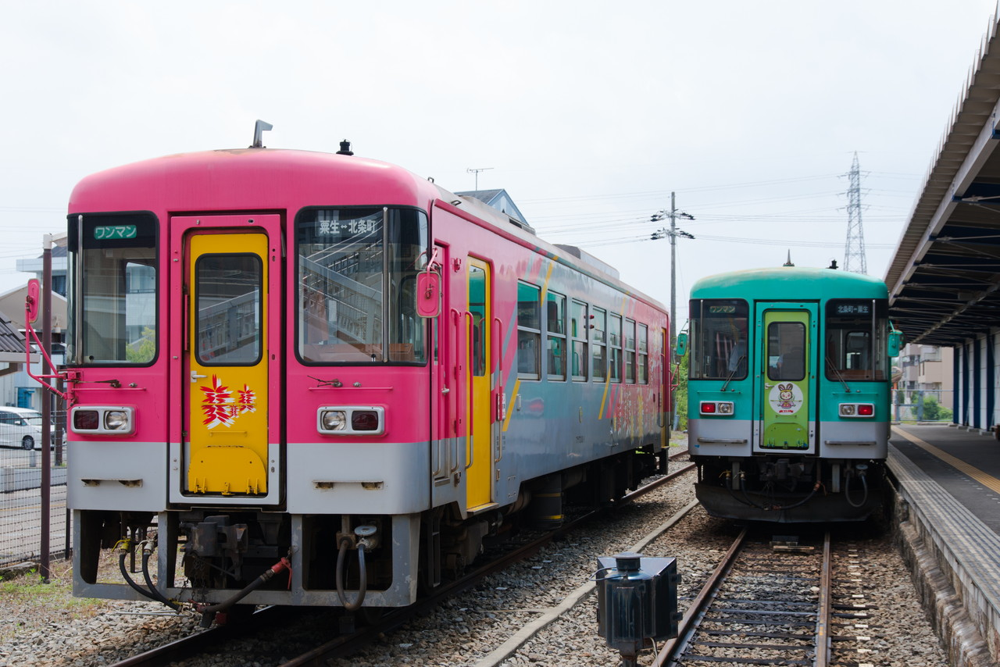
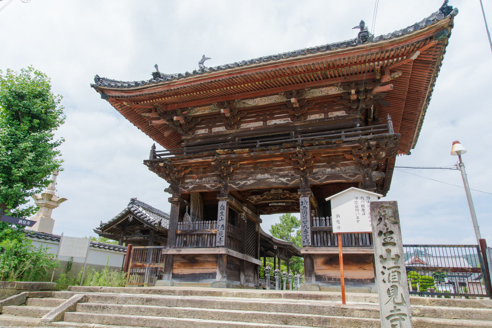
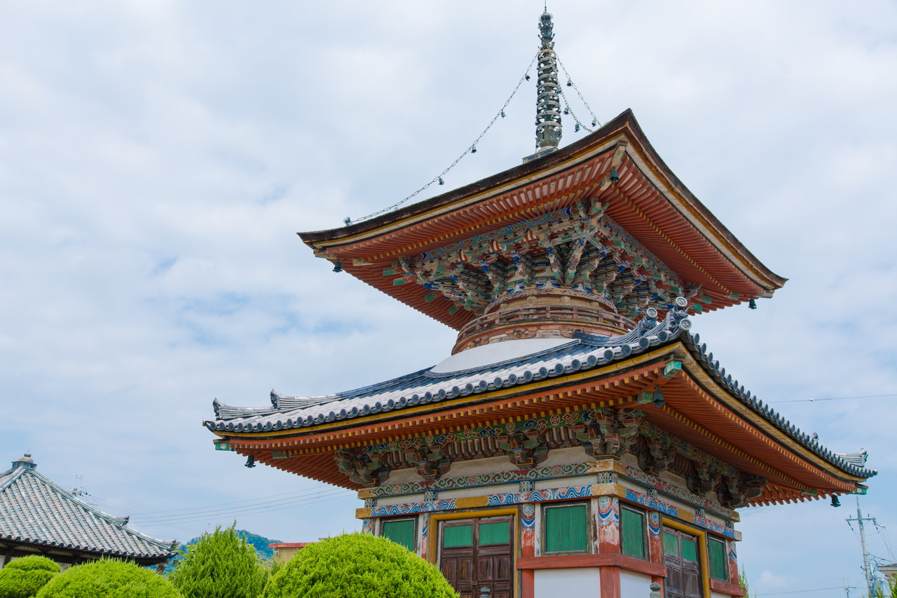
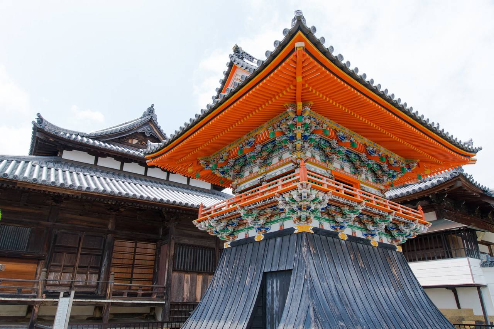
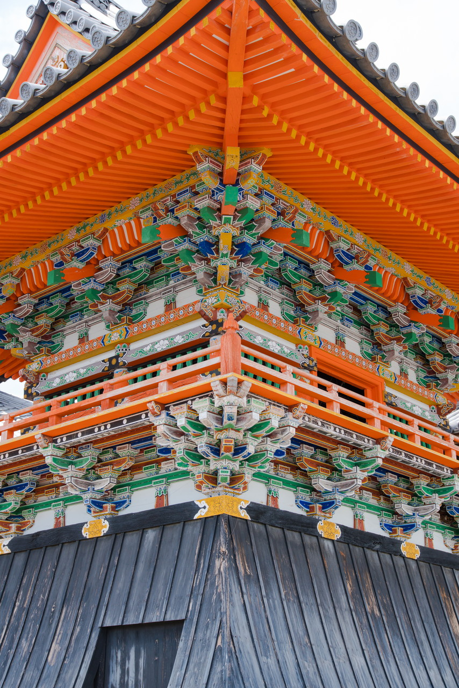
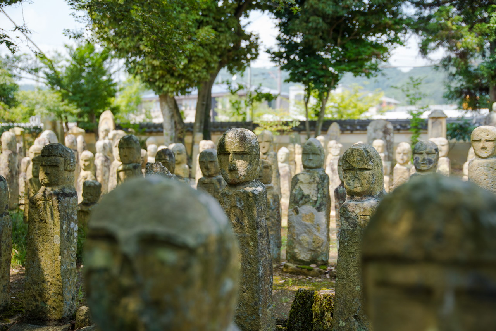
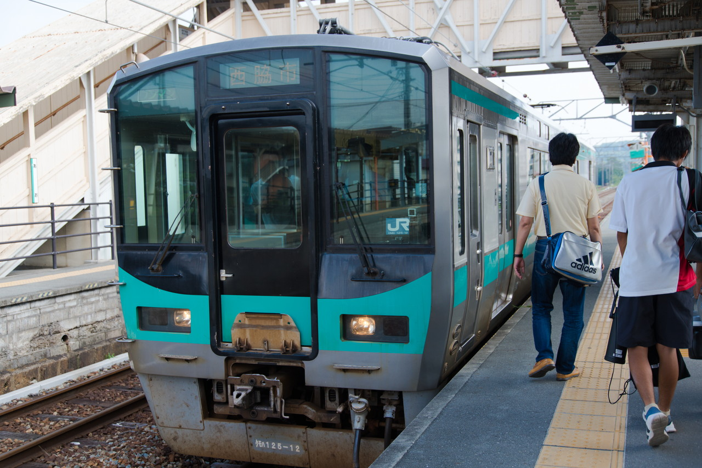
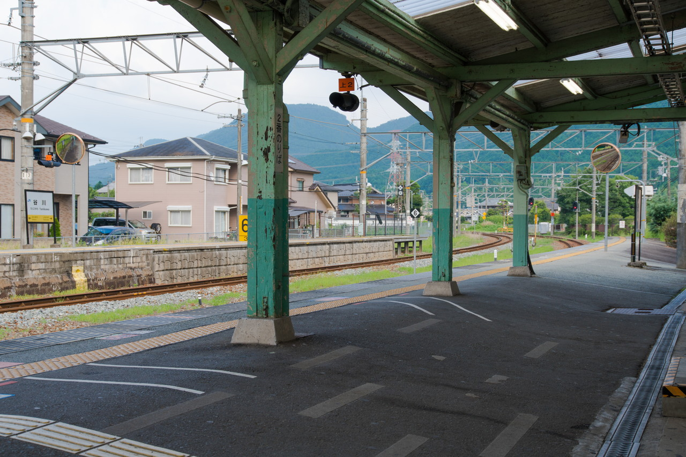

2017年07月30日 酒見寺
サボっていた新西国三十三箇所巡りを再開。  
JRの青春18きっぷの時期もあって、ちょっと遠出しました。  
兵庫県加西市にある[酒見寺(さがみじ)](http://www.shin-saigoku.jp/temple/34_sagamiji_01.html)です。  
たまたま見ていた[Wikipedia](https://ja.wikipedia.org/wiki/%E9%85%92%E8%A6%8B%E5%AF%BA)でこのお寺の鐘楼が極彩色でキレイだなぁ、  
と思ったのが行くきっかけでした。  
ここで御朱印をいただいて、近くの羅漢寺へ。  
ここは五百羅漢像が有名なんだそうです。ここでも御朱印をいただきました。  
酷暑でヘトヘトになりました＿|￣|○  
そのあと、加古川線を縦走し、福知山線経由で帰宅しました。お寺と電車(気動車)とで満喫しました。
  

### 北条鉄道

酒見寺の最寄り駅である北条町駅へは、JR加古川線の粟生駅から北条鉄道に乗ります。　
全線単線の気動車(いわゆるレールバス)運行です。

北条鉄道のレールバス #気動車 #列車 #train #japan #sonya99ii #sigma

### 酒見寺

北条町駅からカンカン照りの中、歩いて10分。酒見寺に到着。  
山門は思っていたより大きかったです。

酒見寺 山門 #酒見寺 #寺 #temple #japan #sonya99ii #sigma

多宝塔も極彩色でキレイでした。

酒見寺 多宝塔 #酒見寺 #寺 #temple #japan #sonya99ii #sigma

件の鐘楼。

酒見寺 鐘楼その1 #酒見寺 #寺 #temple #japan #sonya99ii #sigma

酒見寺 鐘楼その2 #酒見寺 #寺 #temple #japan #sonya99ii #sigma

### 羅漢寺

羅漢寺 五百羅漢像 #羅漢寺 #寺 #temple #japan #sonya99ii #sigma

### 帰宅

帰りは、北条町駅～(北条鉄道)～粟生駅～(JR加古川線)～西脇市駅～(JR加古川線)～谷川駅～(JR福知山線)～大阪駅と遠回りしました。  
鉄分も補給できてよかったです。

JR加古川線粟生駅にて #jr #電車 #train #japan #sonya99ii #sigma

JR加古川線、JR福知山の結節谷川駅にて #jr #電車 #train #japan #sonya99ii #sigma

 
 

他の画像、高解像度は[こちら(Google Photo)](https://goo.gl/photos/TRmPAuvV2NYADZsS9)

---
酒見寺

<iframe src="https://www.google.com/maps/embed?pb=!1m18!1m12!1m3!1d1375.2175796215374!2d134.83064171595566!3d34.93562658493863!2m3!1f0!2f0!3f0!3m2!1i1024!2i768!4f13.1!3m3!1m2!1s0x0%3A0xc72f8b081995c376!2z5rOJ55Sf5bGxIOmFkuimi-Wvug!5e0!3m2!1sja!2sjp!4v1502280377292" width="600" height="450" frameborder="0" style="border:0" allowfullscreen></iframe>

---
### 羅漢寺
<iframe src="https://www.google.com/maps/embed?pb=!1m18!1m12!1m3!1d1375.2175796215374!2d134.83064171595566!3d34.93562658493863!2m3!1f0!2f0!3f0!3m2!1i1024!2i768!4f13.1!3m3!1m2!1s0x0%3A0x69a114ae5f91a8a3!2z5LqU55m-576F5ryi5a-6!5e0!3m2!1sja!2sjp!4v1502280421738" width="600" height="450" frameborder="0" style="border:0" allowfullscreen></iframe>

---

___Sony α99 II(ILCA-99M2)___  
_SIGMA 24-105mm F4 DG HSM Art_
