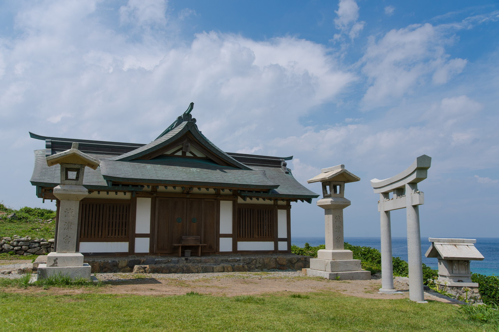

2017年07月17日 宗像大社  
夏期休暇(お盆休み)に帰省しました。  
その際に。今年に世界文化遺産に登録された[宗像大社](http://www.munakata-taisha.or.jp/index.html) (登録名は「『神宿る島』宗像・沖ノ島と関連遺産群」ですね。)に行ってきました。  
九州は福岡育ちですが、宗像大社に行ったことはありませんでした。  
お盆期間中とはいえ、平日だったため参拝客は少なめだった思います。世界文化遺産に登録されたためもっと観光客がいると思っていたのですが・・・。良かったような残念なような・・・。  
写真をメインに参拝した者としてはいい機会でした。  
この日は天気も良く、絶好の参拝日和でした。
  

&nbsp;宗像大社

「宗像大社」といえば、ここのことですね。  
正確には「宗像大社辺津宮」とのことです。  
ここで宗像大社の御朱印をいただきました。

&nbsp;宗像大社 正面の鳥居 #宗像大社 #神社 #shrine #japan #福岡 #fukuoka #世界文化遺産 #sonya99ii #sigma

&nbsp;宗像大社 本殿 #宗像大社 #神社 #shrine #japan #福岡 #fukuoka #世界文化遺産 #sonya99ii #sigma

本殿の入口両脇には目力がある狛犬が鎮座していました。

&nbsp;宗像大社 狛犬 阿形 #宗像大社 #神社 #shrine #japan #福岡 #fukuoka #世界文化遺産 #sonya99ii #sigma

&nbsp;宗像大社 狛犬 吽形 #宗像大社 #神社 #shrine #japan #福岡 #fukuoka #世界文化遺産 #sonya99ii #sigma

&nbsp;宗像大社 高宮祭場 #宗像大社 #神社 #shrine #japan #福岡 #fukuoka #世界文化遺産 #sonya99ii #sigma

&nbsp;大島

宗像大社辺津宮からバスに乗って神湊港へ。そこから旅客船(フェリーもあります)に乗って、「宗像大社中津宮」のある大島へ。  
15～25分くらいで着きます。

&nbsp;旅客船しおかぜ #船 #ship #宗像大社 #神社 #shrine #japan #福岡 #fukuoka #世界文化遺産 #sonya99ii #sigma

お昼ご飯にお刺身定食を食べました。  
おいしかったです。

&nbsp;お刺身定食 #お刺身 #lunch #宗像大社 #神社 #shrine #japan #福岡 #fukuoka #世界文化遺産 #sonya99ii #sigma

ゆっくりご飯を食べた後、「宗像大社中津宮」へ。  
ここで、中津宮、沖津宮遙拝所の御朱印をいただきました。

&nbsp;宗像大社　中津宮 #宗像大社 #神社 #shrine #japan #福岡 #fukuoka #世界文化遺産 #sonya99ii #sigma

&nbsp;宗像大社　中津宮　本殿 #宗像大社 #神社 #shrine #japan #福岡 #fukuoka #世界文化遺産 #sonya99ii #sigma

この後、中津宮から沖津宮遙拝所へ。歩いて45分くらいです。  
炎天下だったためしんどかったです＿|￣|○

&nbsp;宗像大社　沖津宮遙拝所 #宗像大社 #神社 #shrine #japan #福岡 #fukuoka #世界文化遺産 #sonya99ii #sigma

天気は良かったのですが、カンカン照りの所為か沖ノ島の方はモヤがかかって見えませんでした。  
海はキレイでした。

&nbsp;沖津宮遙拝所から沖ノ島を望む #海 #sea #宗像大社 #神社 #shrine #japan #福岡 #fukuoka #世界文化遺産 #sonya99ii #sigma

&nbsp;沖津宮遙拝所から海の眺め #海 #sea #宗像大社 #神社 #shrine #japan #福岡 #fukuoka #世界文化遺産 #sonya99ii #sigma

実は歩かなくても要所を巡回するバスもあります。  
詳しくは西鉄バスのサイトを参照ください。

&nbsp;観光バスもある #バス #bus #宗像大社 #神社 #shrine #japan #福岡 #fukuoka #世界文化遺産 #sonya99ii #sigma

 
 

他の画像、高解像度は[こちら(Google Photo)](https://goo.gl/photos/2Y7Hoh6bWufocwZf6)

---
&nbsp;宗像大社(辺津宮)
<iframe src="https://www.google.com/maps/embed?pb=!1m18!1m12!1m3!1d38048.44205988162!2d130.52356468563042!3d33.816871786518504!2m3!1f0!2f0!3f0!3m2!1i1024!2i768!4f13.1!3m3!1m2!1s0x0%3A0x39bafeca460cb066!2z5a6X5YOP5aSn56S-!5e0!3m2!1sja!2sjp!4v1503230646478" width="600" height="450" frameborder="0" style="border:0" allowfullscreen></iframe>

---
&nbsp;宗像大社(中津宮)
<iframe src="https://www.google.com/maps/embed?pb=!1m18!1m12!1m3!1d38023.44510285439!2d130.44955244160178!3d33.87302389224317!2m3!1f0!2f0!3f0!3m2!1i1024!2i768!4f13.1!3m3!1m2!1s0x0%3A0xdcc778f66ba549db!2z5a6X5YOP5aSn56S-5Lit5rSl5a6u!5e0!3m2!1sja!2sjp!4v1503230775630" width="600" height="450" frameborder="0" style="border:0" allowfullscreen></iframe>

---
&nbsp;宗像大社(沖津宮遙拝所)
<iframe src="https://www.google.com/maps/embed?pb=!1m18!1m12!1m3!1d38023.44510285439!2d130.44955244160178!3d33.87302389224317!2m3!1f0!2f0!3f0!3m2!1i1024!2i768!4f13.1!3m3!1m2!1s0x0%3A0xbbf927b5b211a5a8!2z5a6X5YOP5aSn56S-5rKW5rSl5a6u6YGZ5oud5omA!5e0!3m2!1sja!2sjp!4v1503230845324" width="600" height="450" frameborder="0" style="border:0" allowfullscreen></iframe>

---
___Sony α99 II(ILCA-99M2)___  
_SIGMA 24-105mm F4 DG HSM Art_
