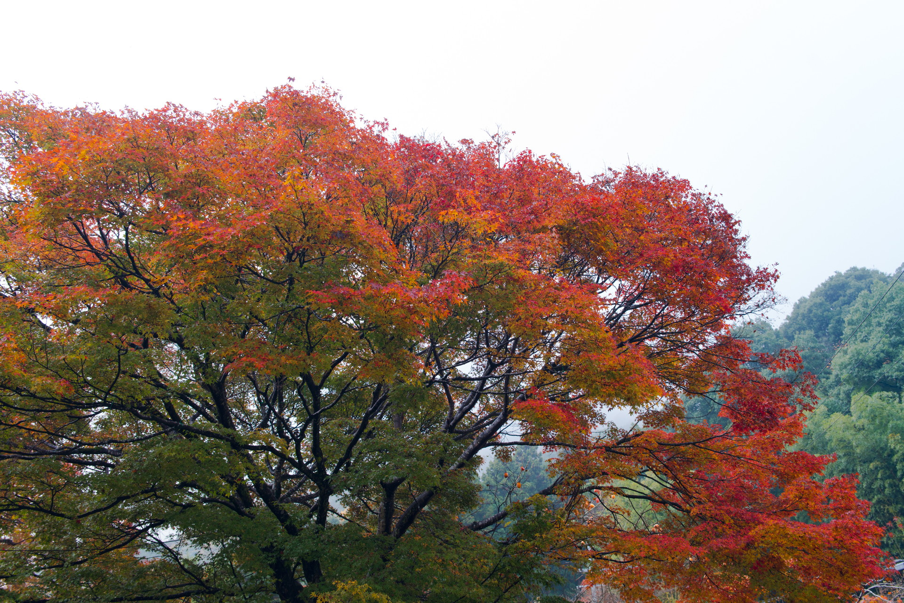
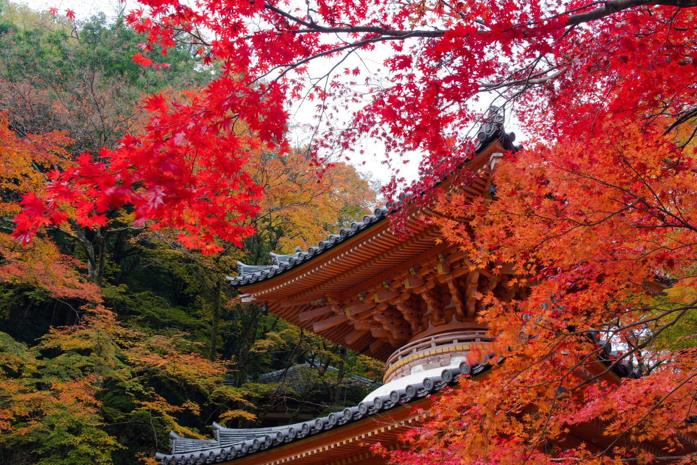

2017年11月23日 牛滝山 大威徳寺  
秋も深まり、紅葉の季節です。  
11月に入って、週末が雨降りが多く、写真を撮りに行けず、ヤキモキしてました。  
どこに行こうかと色々調べていたところ、大阪が良さげのところがありました。  
「牛滝山　大威徳寺」です。  
紅葉の名所らしく人出が多いと思い、朝の早めに着くように出発しました。  
前日の雨露が残り、しっとりした空気感で良かったのですが、気温が10℃以下で、  
寒かったです・・・。  
晴れてくると日差しがあり、いい感じになりました。  
紅葉の具合もちょうど良く、キレイでした。    
  

&nbsp;寒い朝{{ (>_<) }}

&nbsp;大威徳寺の前の山 #紅葉 #モミジ #牛滝山 #寺 #temple #japan #kyoto #京都 #sonya99ii #sigma

&nbsp;参道の紅葉

&nbsp;参道の紅葉 #紅葉 #モミジ #牛滝山 #寺 #temple #japan #kyoto #京都 #sonya99ii #sigma

&nbsp;大威徳寺

&nbsp;山門 #紅葉 #モミジ #牛滝山 #寺 #temple #japan #kyoto #京都 #sonya99ii #sigma

&nbsp;山門 #紅葉 #モミジ #牛滝山 #寺 #temple #japan #kyoto #京都 #sonya99ii #sigma

&nbsp;境内のモミジ その2 #紅葉 #モミジ #牛滝山 #寺 #temple #japan #kyoto #京都 #sonya99ii #sigma

&nbsp;境内のモミジ その3 #紅葉 #モミジ #牛滝山 #寺 #temple #japan #kyoto #京都 #sonya99ii #sigma

&nbsp;境内のモミジ その4 #紅葉 #モミジ #牛滝山 #寺 #temple #japan #kyoto #京都 #sonya99ii #sigma

&nbsp;境内のモミジ その5 #紅葉 #モミジ #牛滝山 #寺 #temple #japan #kyoto #京都 #sonya99ii #sigma

&nbsp;境内のモミジ その6 #紅葉 #モミジ #牛滝山 #寺 #temple #japan #kyoto #京都 #sonya99ii #sony

 
 

他の画像、高解像度は[こちら(Google Photo)](https://photos.app.goo.gl/hcAZGfW2m7xdkN8o1)

---
&nbsp;夢コスモス園)
<iframe src="https://www.google.com/maps/embed?pb=!1m14!1m8!1m3!1d13070.711968782087!2d135.553887!3d35.014765!3m2!1i1024!2i768!4f13.1!3m3!1m2!1s0x0%3A0xfd848762fb9f3a86!2z5Lqs6YO95Li55rOi77yP5LqA5bKh44CO5aSi44Kz44K544Oi44K55ZyS44CP!5e0!3m2!1sja!2sjp!4v1508048865513" width="600" height="450" frameborder="0" style="border:0" allowfullscreen></iframe>

---
___Sony α99 II(ILCA-99M2)___  
_SIGMA 24-105mm F4 DG HSM Art_  
_SONY 70-300mm F4.5-5.6 G SSM_  
_SIGMA MACRO 105mm F2.8 EX DG OS HSM_  
_SONY 50mm F1.4 SAL50F14_  
