2017年11月24日 八瀬  
紅葉狩り、2日目。  
洛北の八瀬に行ってきました。  
意外に人が多くてびっくりしました。  
場所は、叡山ケーブルの八瀬駅付近にある「八瀬もみじの小径」です。  
山の斜面にある遊歩道で、モミジの木々があり、モミジが赤、橙、黄に輝きキレイでした。    
  

&nbsp;叡山電鉄 八瀬比叡山口駅周辺

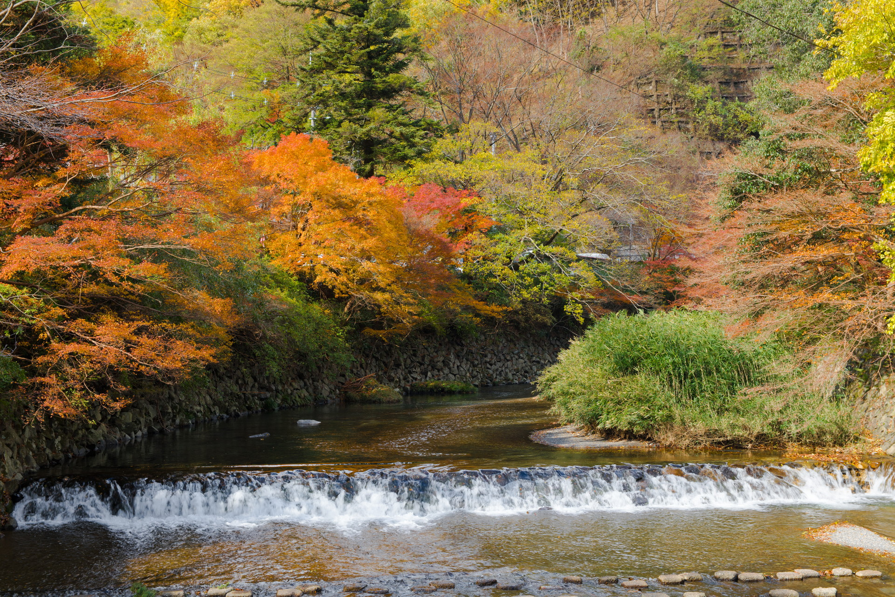
&nbsp;駅前の橋 #紅葉 #モミジ #八瀬 #japan #kyoto #京都 #sonya99ii #sigma

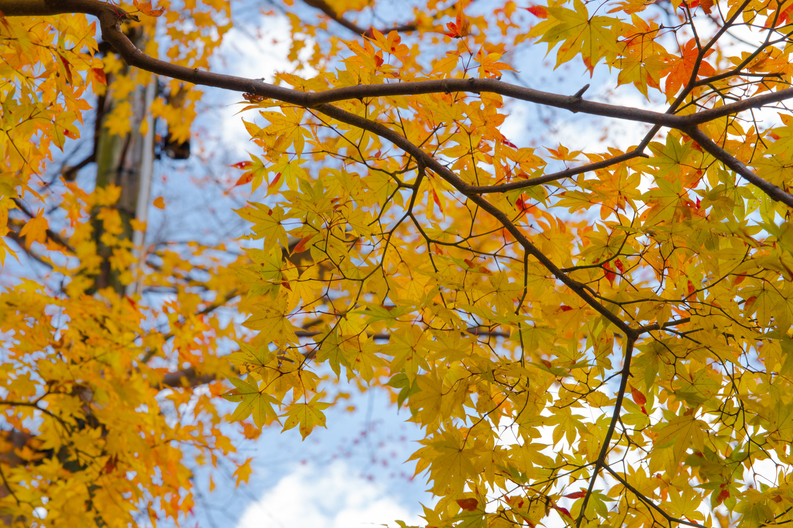
&nbsp;駅前の橋 #紅葉 #モミジ #八瀬 #japan #kyoto #京都 #sonya99ii #sigma#sigma

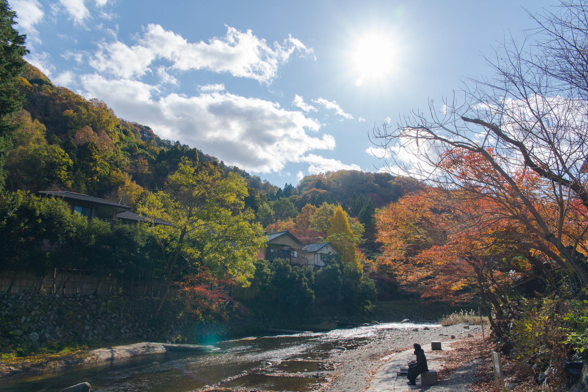
&nbsp;高野川周辺 #紅葉 #モミジ #八瀬 #japan #kyoto #京都 #sonya99ii #sigma#sigma

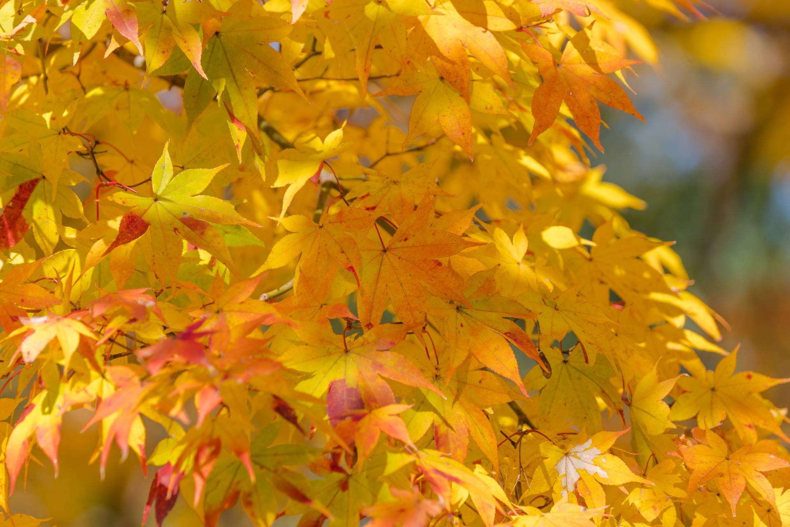
&nbsp;駅前周辺 その2#紅葉 #モミジ #八瀬 #japan #kyoto #京都 #sonya99ii #sigma#sony

&nbsp;八瀬の小径周辺

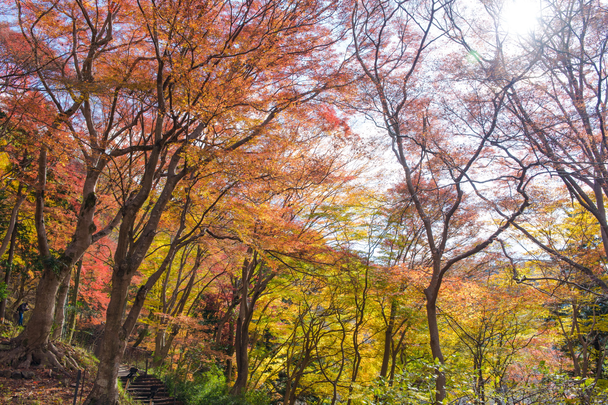
&nbsp;八瀬の小径周辺 その2 #紅葉 #モミジ #八瀬 #japan #kyoto #京都 #sonya99ii #sigma#sigma

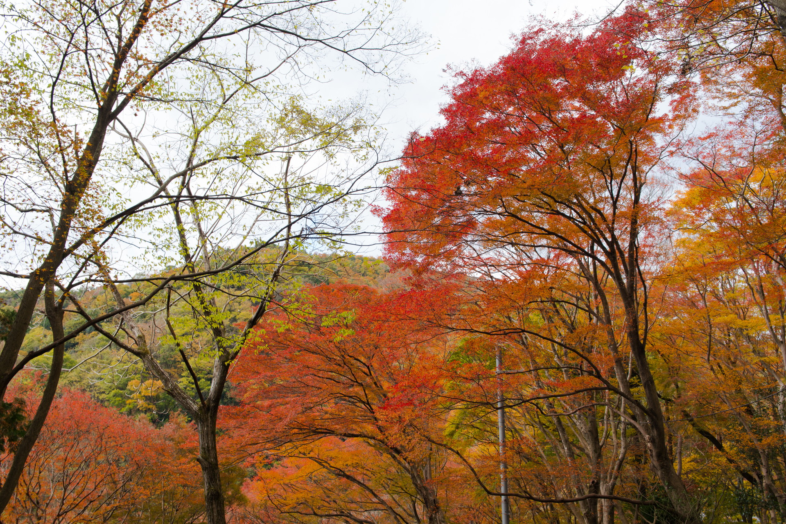
&nbsp;八瀬の小径周辺 その4 #紅葉 #モミジ #八瀬 #japan #kyoto #京都 #sonya99ii #sigma#sigma

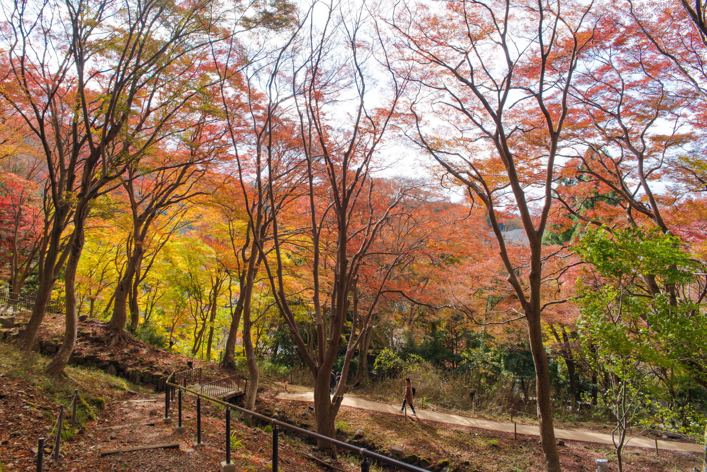
&nbsp;八瀬の小径周辺 その5 #紅葉 #モミジ #八瀬 #japan #kyoto #京都 #sonya99ii #sigma#sigma

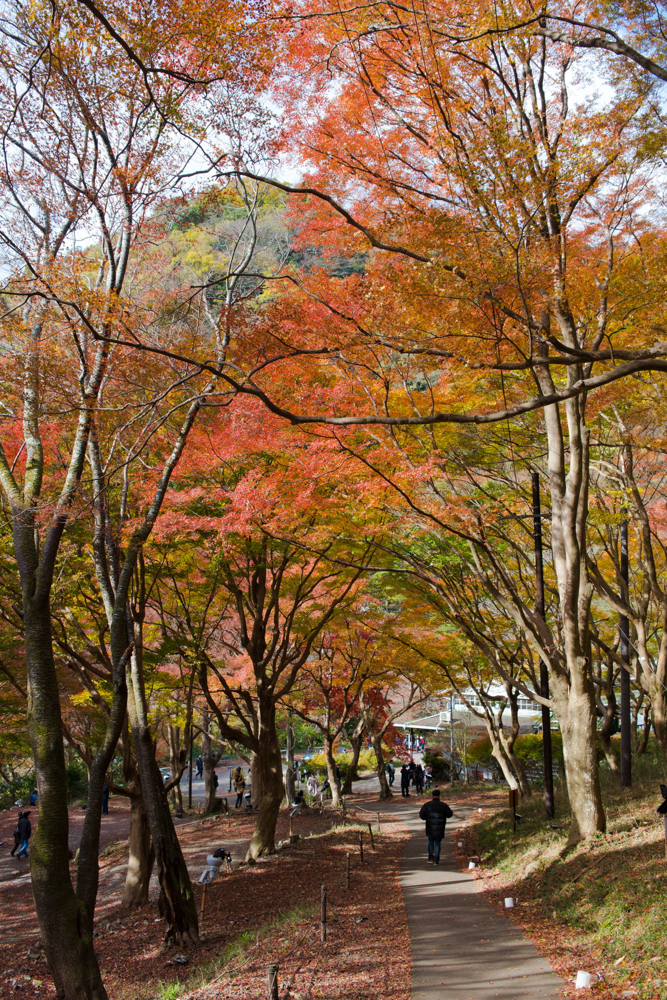
&nbsp;八瀬の小径周辺 その6 #紅葉 #モミジ #八瀬 #japan #kyoto #京都 #sonya99ii #sigma#sigma

&nbsp;八瀬の小径周辺（ちょっと雰囲気を変えてみた）/span>

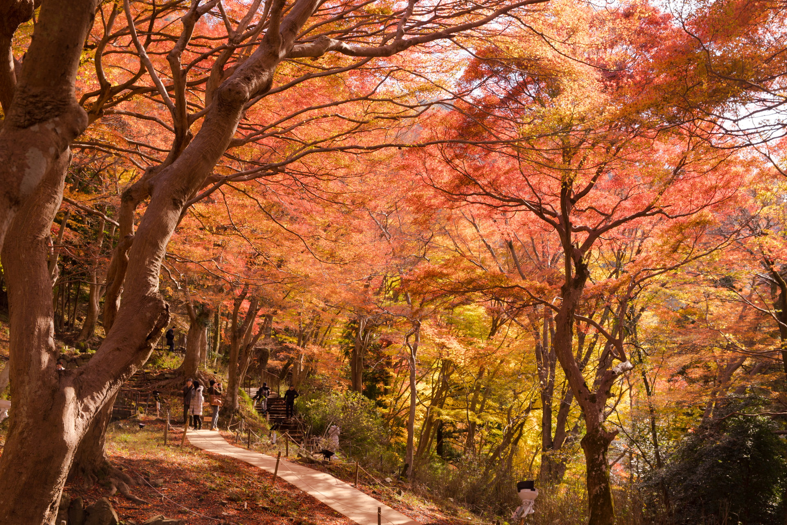
&nbsp;八瀬の小径周辺 その1 #紅葉 #モミジ #八瀬 #japan #kyoto #京都 #sonya99ii #sigma#sigma

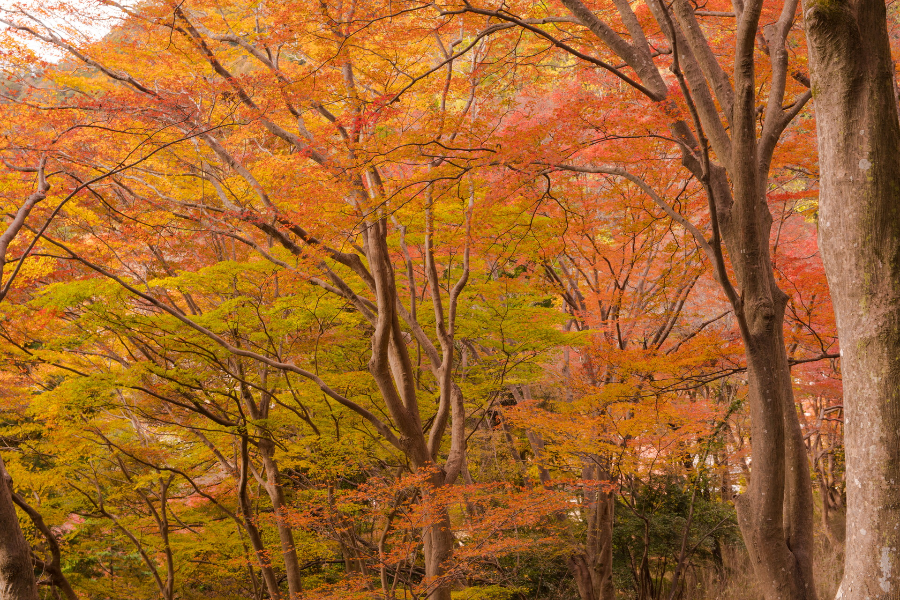
&nbsp;八瀬の小径周辺 その3 #紅葉 #モミジ #八瀬 #japan #kyoto #京都 #sonya99ii #sigma#sigma

&nbsp;平安遷都紀念塔

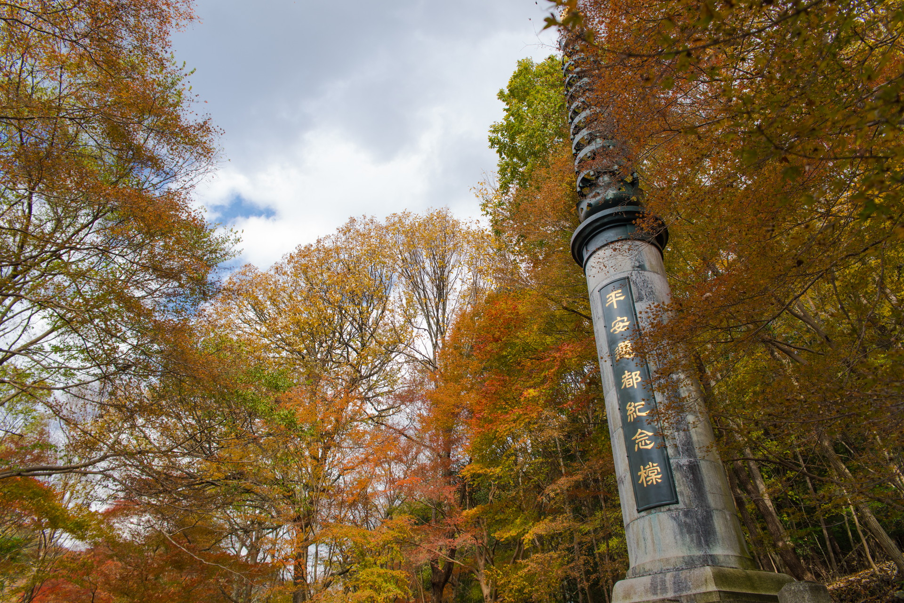
&nbsp;平安遷都紀念塔 #紅葉 #モミジ #八瀬 #japan #kyoto #京都 #sonya99ii #sigma#sigma
 
 

他の画像、高解像度は[こちら(Google Photo)](https://photos.app.goo.gl/thoredTHUyXJ4E402)

---
&nbsp;八瀬比叡山口駅
<iframe src="https://www.google.com/maps/embed?pb=!1m18!1m12!1m3!1d3265.6623084895696!2d135.80627531642915!3d35.065180980342454!2m3!1f0!2f0!3f0!3m2!1i1024!2i768!4f13.1!3m3!1m2!1s0x600109dd52e61783%3A0x679f62d6fa6e7bf0!2z5YWr54Cs5q-U5Y-h5bGx5Y-j6aeF!5e0!3m2!1sja!2sjp!4v1512065332412" width="600" height="450" frameborder="0" style="border:0" allowfullscreen></iframe>

---
___Sony α99 II(ILCA-99M2)___  
_SIGMA 24-70mm F2.8 IF EX DG HSM_  
_SONY 70-300mm F4.5-5.6 G SSM_  
 
