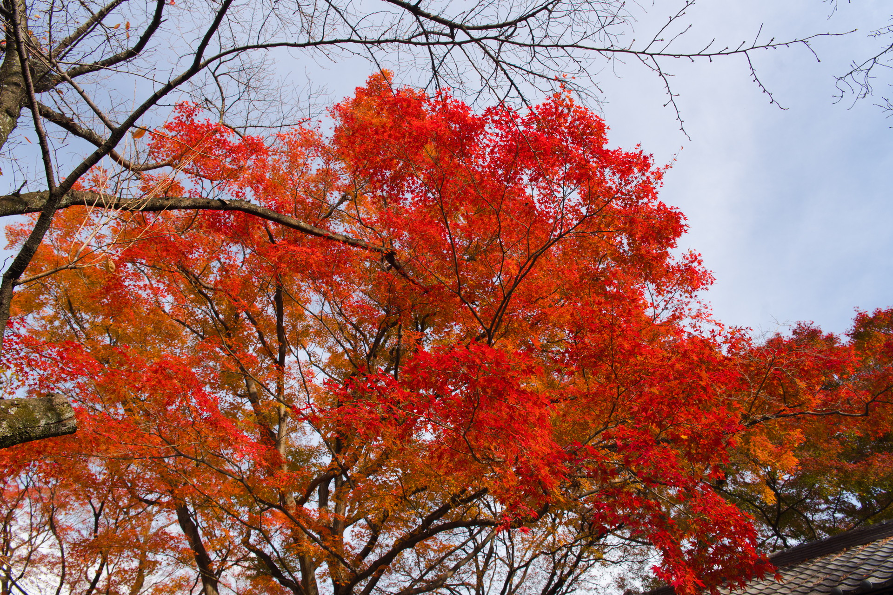
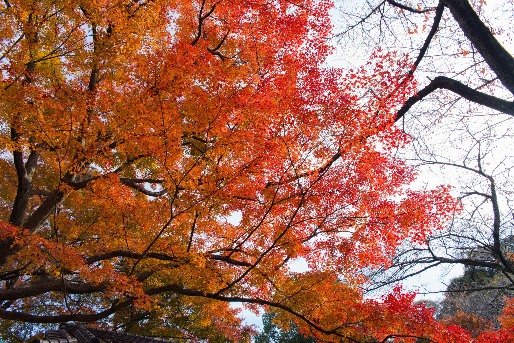
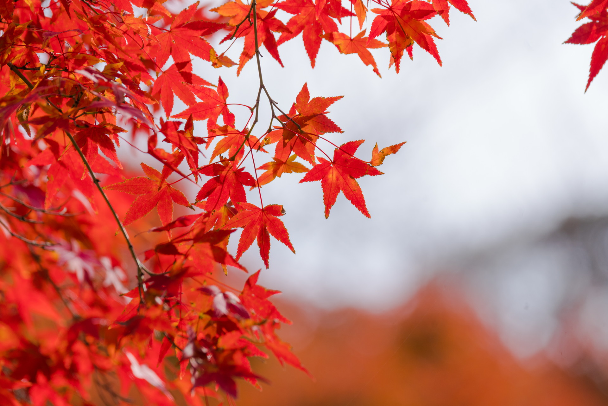
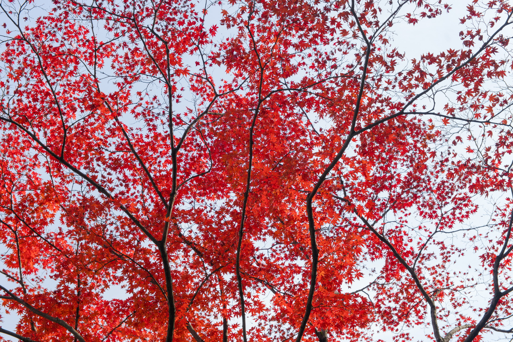
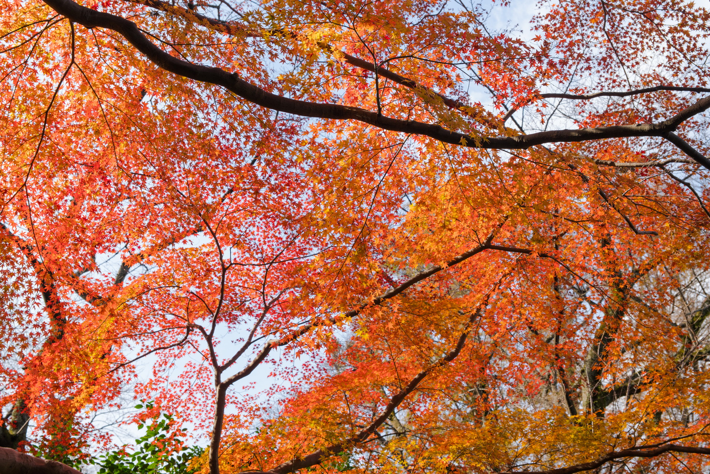
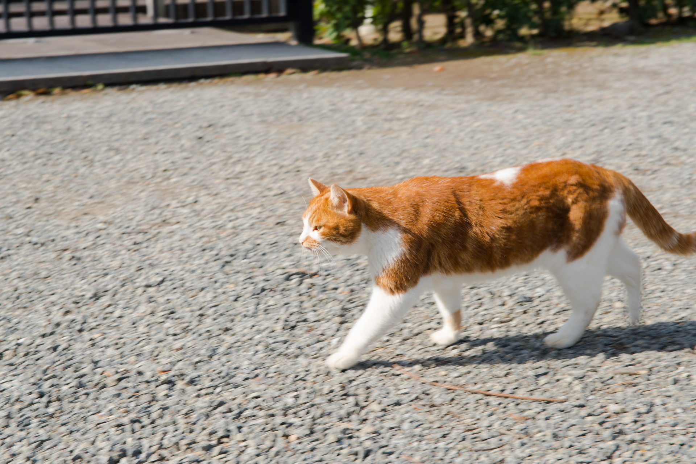
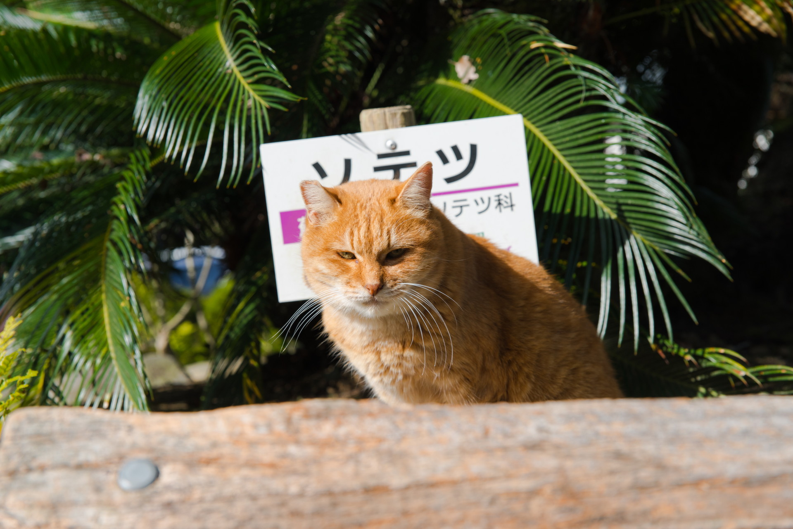
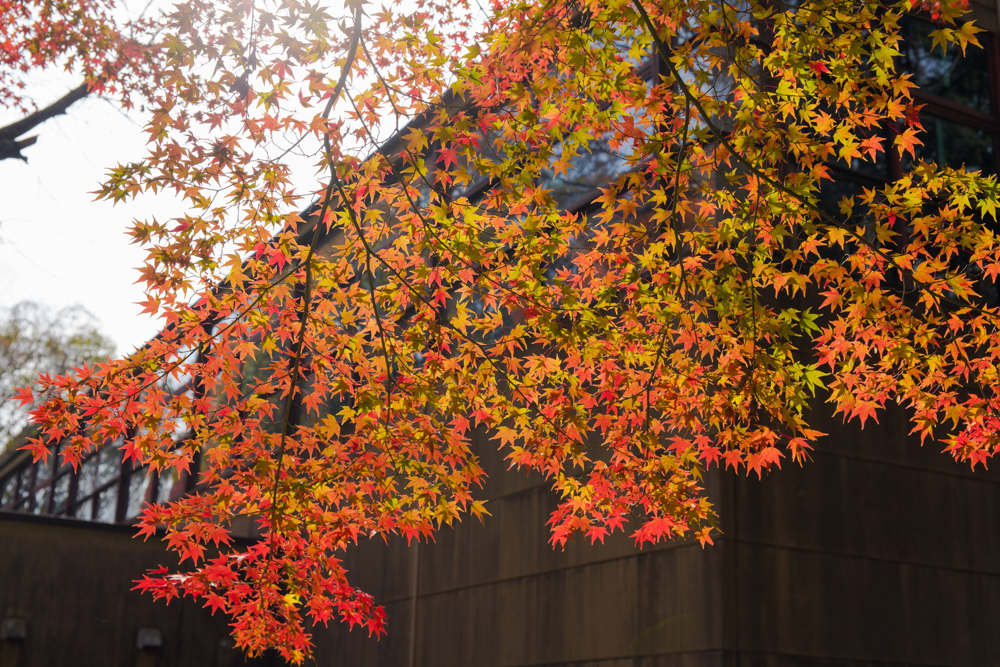
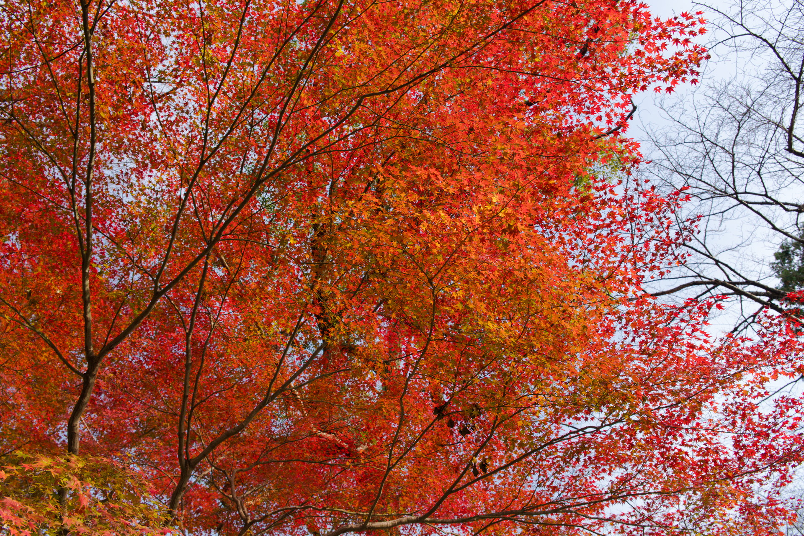

2017年11月25日 男山  
紅葉狩り、3日目。  
京都南部の八幡市にある男山に行ってきました。  
ここは石清水八幡宮が有名ですが、八幡宮には目もくれず、紅葉を撮ってきました。  
モミジの木は多くはありませんが、キレイに色付いていました。  
  

&nbsp;男山展望台

男山の頂上へは京阪 八幡市駅からケーブルカーで5分ほど。  
そこから展望台へ。歩いて3分。

&nbsp;男山展望台 その1 #紅葉 #モミジ #男山 #japan #kyoto #京都 #sonya99ii #sigma

&nbsp;男山展望台 その2 #紅葉 #モミジ #男山 #japan #kyoto #京都 #sonya99ii #sigma

&nbsp;男山展望台 その3 #紅葉 #モミジ #男山 #japan #kyoto #京都 #sonya99ii #sony

&nbsp;石清水八幡宮周辺

展望台から八幡宮へ。その周辺のモミジです。

&nbsp;八幡宮周辺 その1 #紅葉 #モミジ #男山 #japan #kyoto #京都 #sonya99ii #sigma

&nbsp;八幡宮周辺 その2 #紅葉 #モミジ #男山 #japan #kyoto #京都 #sonya99ii #sigma

&nbsp;閑話休題

閑話休題。猫いた。

&nbsp;ネコ #ネコ #猫 #cat #男山 #japan #kyoto #京都 #sonya99ii #sigma

&nbsp;ソテツ #ネコ #猫 #cat #男山 #japan #kyoto #京都 #sonya99ii #sigma

&nbsp;石清水八幡宮周辺 つづき

&nbsp;八幡宮周辺 その3 #紅葉 #モミジ #男山 #japan #kyoto #京都 #sonya99ii #sigma

&nbsp;八幡宮周辺 その4 #紅葉 #モミジ #男山 #japan #kyoto #京都 #sonya99ii #sigma

 
 

他の画像、高解像度は[こちら(Google Photo)](https://photos.app.goo.gl/kGV0xKRzxtgcdk7L2)

---
&nbsp;男山
<iframe src="https://www.google.com/maps/embed?pb=!1m18!1m12!1m3!1d1097.5173757252958!2d135.69993560670954!3d34.88025799261447!2m3!1f0!2f0!3f0!3m2!1i1024!2i768!4f13.1!3m3!1m2!1s0x0%3A0x513bd2b62cf491b0!2z55S35bGx5bGV5pyb5Y-w!5e0!3m2!1sja!2sjp!4v1512299260240" width="600" height="450" frameborder="0" style="border:0" allowfullscreen></iframe>

---

&nbsp;石清水八幡宮
<iframe src="https://www.google.com/maps/embed?pb=!1m18!1m12!1m3!1d1097.5173757252958!2d135.69993560670954!3d34.88025799261447!2m3!1f0!2f0!3f0!3m2!1i1024!2i768!4f13.1!3m3!1m2!1s0x0%3A0x5cd5dfde739270c7!2z55-z5riF5rC05YWr5bmh5a6u!5e0!3m2!1sja!2sjp!4v1512299336729" width="600" height="450" frameborder="0" style="border:0" allowfullscreen></iframe>

---
___Sony α99 II(ILCA-99M2)___  
_SIGMA 24-70mm F2.8 IF EX DG HSM_  
_SONY 70-300mm F4.5-5.6 G SSM_  
 
