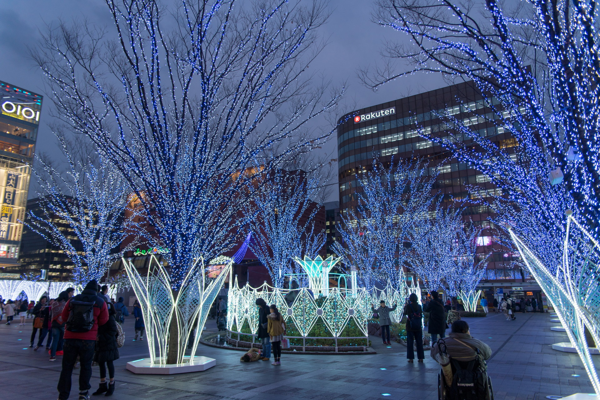
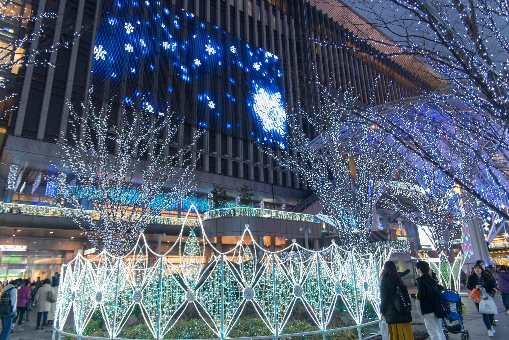
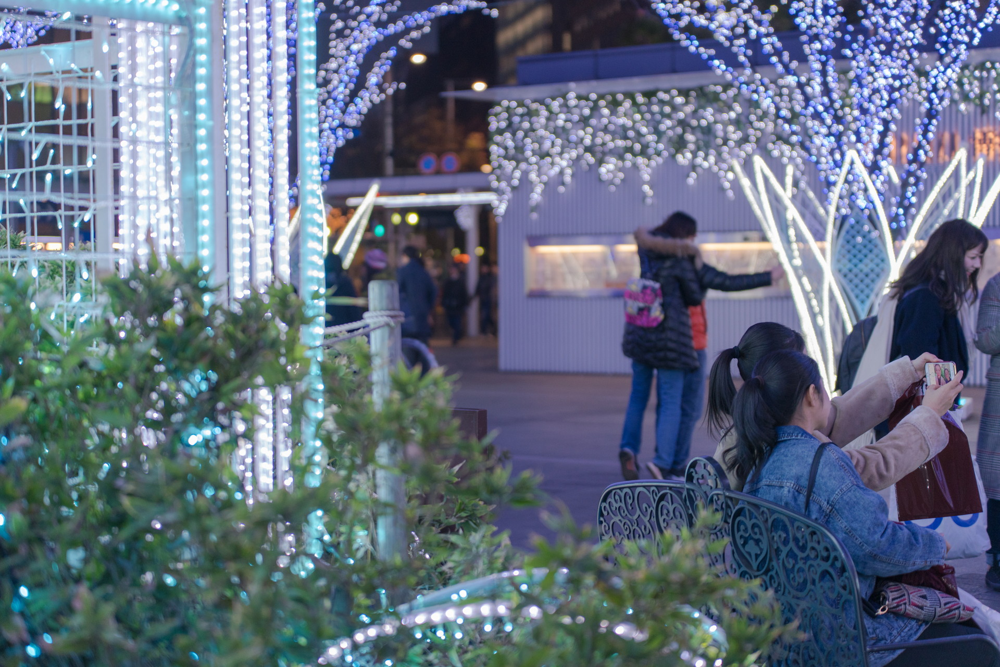
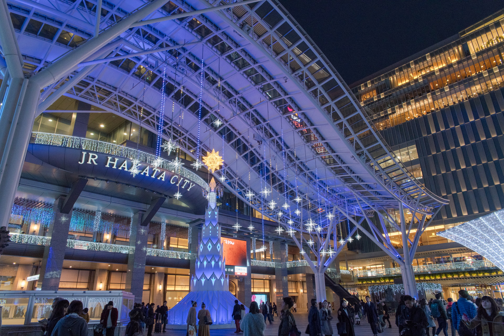
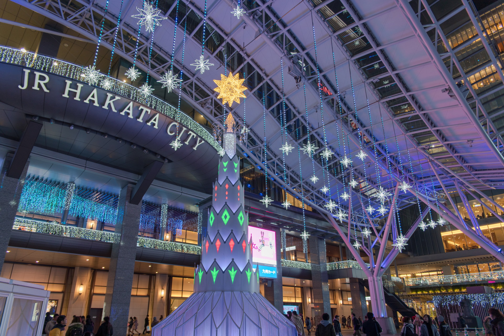
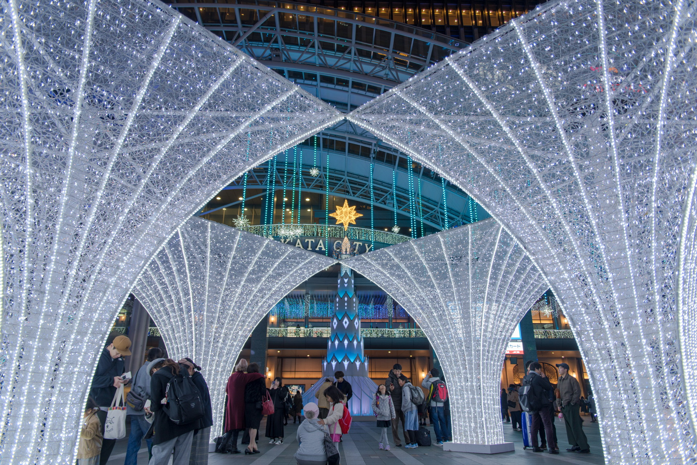
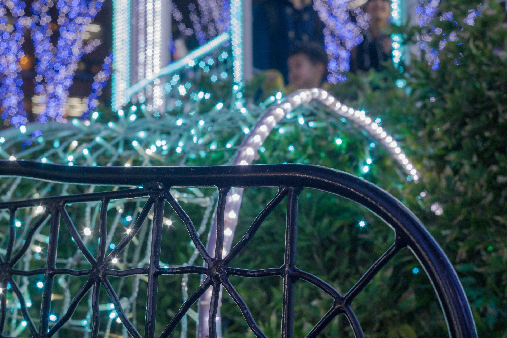
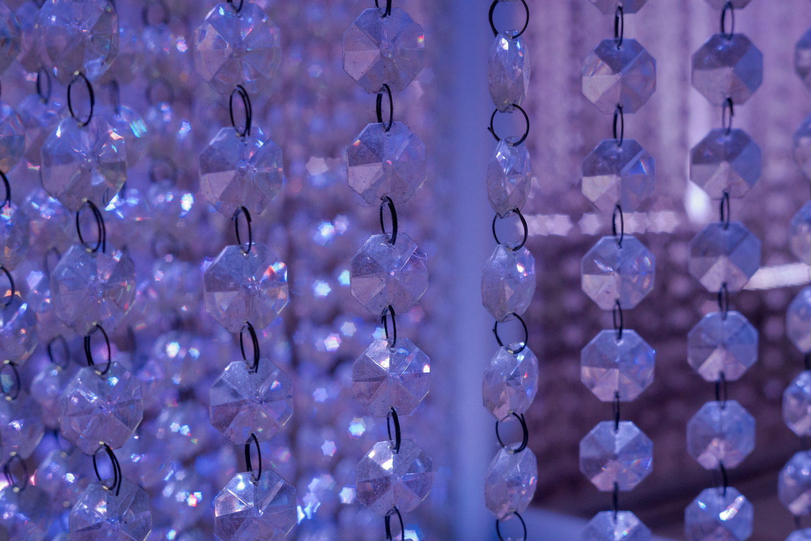
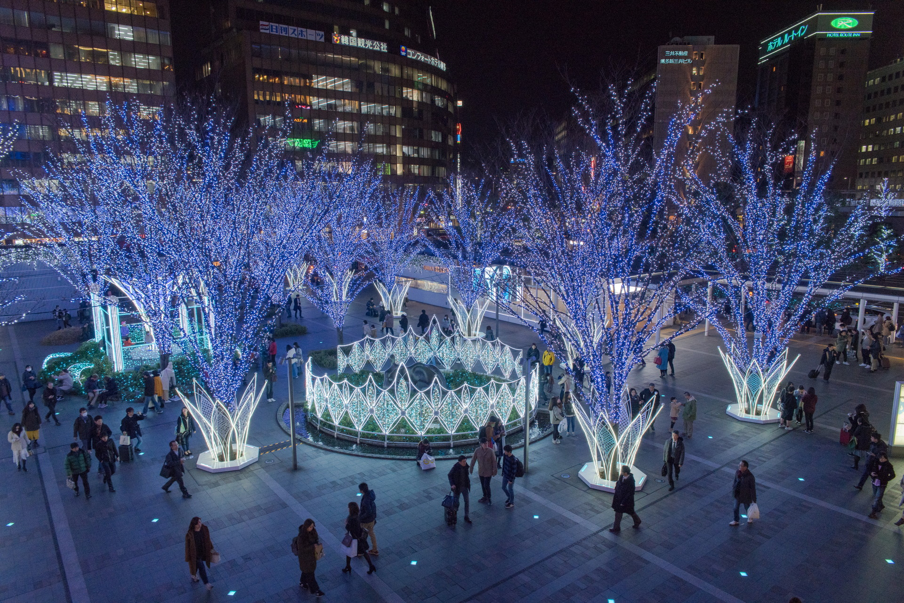

2017年12月28日 博多駅  
年末年始ですので、福岡に帰省しています。  
今年のイルミネーションの撮影は、これが初です。    

&nbsp;博多駅イルミネーション

博多駅・博多口の駅前広場です。  
華やかでキレイでした。

&nbsp;博多駅イルミネーション その1 #イルミネーション #illumination #駅 #japan #fukuoka #福岡 #sonya99ii #sigma

&nbsp;博多駅イルミネーション その2 #イルミネーション #illumination #駅 #japan #fukuoka #福岡 #sonya99ii #sigma

&nbsp;博多駅イルミネーション その3 #イルミネーション #illumination #駅 #japan #fukuoka #福岡 #sonya99ii #sigma

&nbsp;博多駅イルミネーション その4 #イルミネーション #illumination #駅 #japan #fukuoka #福岡 #sonya99ii #sigma

&nbsp;博多駅イルミネーション その5 #イルミネーション #illumination #駅 #japan #fukuoka #福岡 #sonya99ii #sigma

&nbsp;博多駅イルミネーション その6 #イルミネーション #illumination #駅 #japan #fukuoka #福岡 #sonya99ii #sigma

&nbsp;☆のボケ

「INDUSTAR-61 L/Z MC 50mm F2.8」というレンズで☆のボケが出ます。

&nbsp;☆のボケ その1 #イルミネーション #illumination #駅 #japan #fukuoka #福岡 #sonya99ii #sigma

&nbsp;☆のボケ その2 #イルミネーション #illumination #駅 #japan #fukuoka #福岡 #sonya99ii #sigma

&nbsp;上から

博多駅の2階(3階か？)からのイルミネーション

&nbsp;博多駅イルミネーション その7 #イルミネーション #illumination #駅 #japan #fukuoka #福岡 #sonya99ii #sigma

 
 

他の画像、高解像度は[こちら(Google Photo)](https://photos.app.goo.gl/uDCLBqjYkXUU2Uql1)

---
&nbsp;博多駅
<iframe src="https://www.google.com/maps/embed?pb=!1m18!1m12!1m3!1d3323.588002700123!2d130.41842181487877!3d33.59004488073415!2m3!1f0!2f0!3f0!3m2!1i1024!2i768!4f13.1!3m3!1m2!1s0x354191c7e6f9b375%3A0x2ee22b3d45b98b90!2z5Y2a5aSa6aeF!5e0!3m2!1sja!2sjp!4v1514617306681" width="600" height="450" frameborder="0" style="border:0" allowfullscreen></iframe>

---
___Sony α99 II(ILCA-99M2)___  
_SIGMA 24-70mm F2.8 IF EX DG HSM_  
_SIGMA APO 70-200mm F2.8 EX DG OS HSM_  
_INDUSTAR-61 L/Z MC 50mm F2.8_
 
