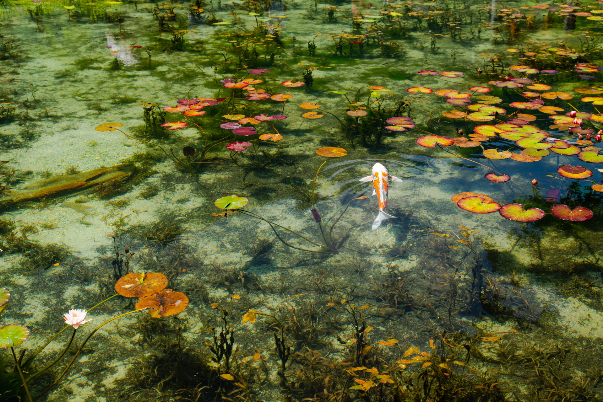

2018年07月15日 岐阜 モネの池  
7月の3連休、どこに行こうかといろいろサイトを漁ってました。ヒマワリはまだ早い。  
蓮、睡蓮か・・・で思い出した。岐阜にモネの池があるってどこかで見た。行くか。  
JR岐阜駅まで、名古屋経由で2時間ほど。JR岐阜駅からバスで1時間、そこからコミュニティバスに  
乗り換えて15分。件の「モネの池」に到着。  
最高気温が35℃を超えているみたいで、とにかく暑かったです。  
神社の傍らに池があり、そこが目的の池でした。人は多かったですが、思った程ではなかった。  
先週の豪雨の影響も過ぎたのか、池は澄んでいてキレイでした。

&nbsp;JR岐阜駅

JR岐阜駅に到着。  

&nbsp;JR岐阜駅 普通列車

&nbsp;JR岐阜駅 駅舎

&nbsp;織田信長

&nbsp;JR岐阜駅 織田信長の像 #岐阜 #gifu #歴史 #histroy #織田信長 #sonya99ii #sigma24105art

JR岐阜駅からバスで1時間、コミュニティバスで15分で目的地に到着。  

&nbsp;根道神社

&nbsp;根道神社

&nbsp;根道神社

&nbsp;モネの池
 

&nbsp;岐阜　モネの池 #gifu #モネの池 #japan #sonya99 #sigma24105art

&nbsp;岐阜　モネの池 #gifu #モネの池 #japan #sonya99 #sigma24105art

&nbsp;岐阜　モネの池 #gifu #モネの池 #japan #sonya99 #sigma24105art

&nbsp;岐阜　モネの池 #gifu #モネの池 #japan #sonya99 #sigma24105art

 
 

他の画像、高解像度は[こちら(Google Photo)](https://photos.app.goo.gl/evpaz84GWkERcN4X6)

---
&nbsp;岐阜 モネの池
<iframe src="https://www.google.com/maps/embed?pb=!1m14!1m8!1m3!1d12968.106962672651!2d136.821435!3d35.6517128!3m2!1i1024!2i768!4f13.1!3m3!1m2!1s0x0%3A0x7d422ba64279c78!2z5ZCN44KC44Gq44GN5rGg77yI6YCa56ew77ya44Oi44ON44Gu5rGg77yJTW9uZXQgUG9uZA!5e0!3m2!1sja!2sjp!4v1531739546993" width="600" height="450" frameborder="0" style="border:0" allowfullscreen></iframe>

---
___Sony α99 II(ILCA-99M2)___  
_SIGMA 24-105mm F4 DG HSM Art_ 
 
